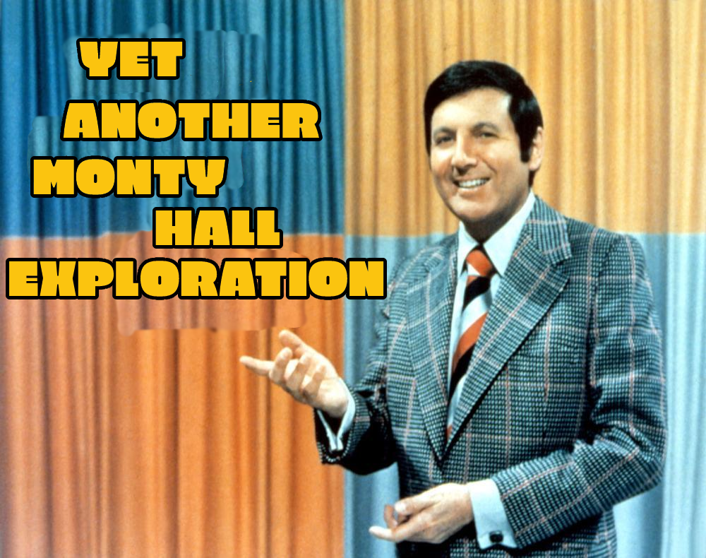
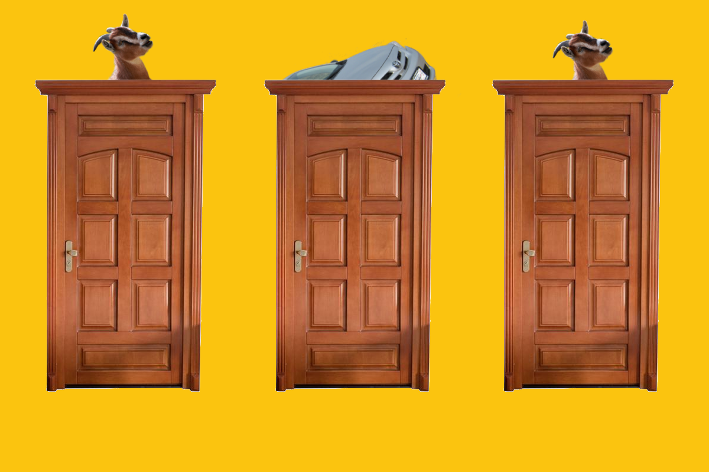
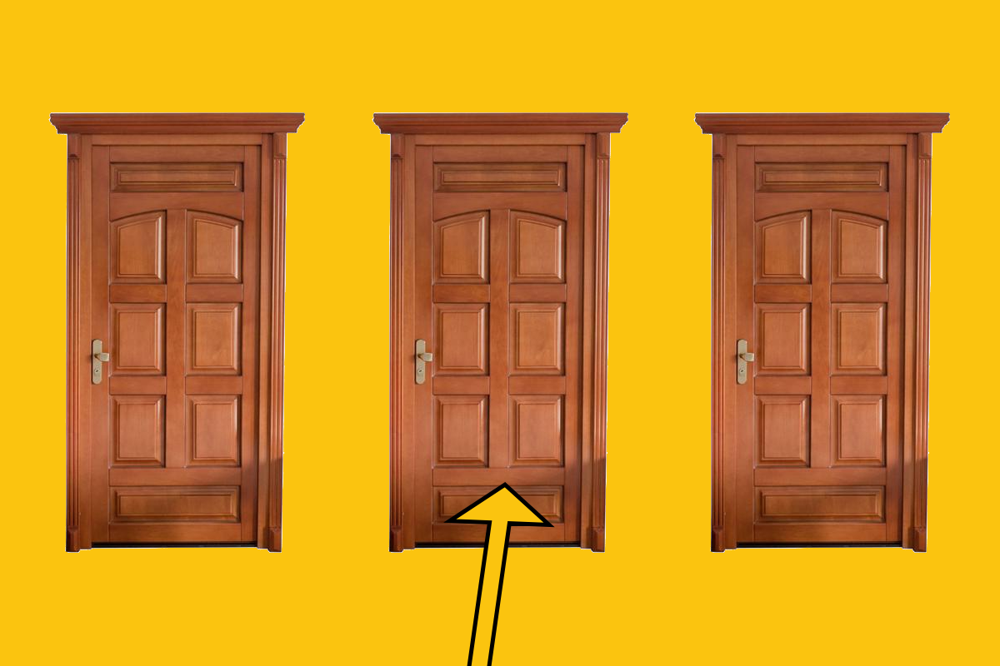
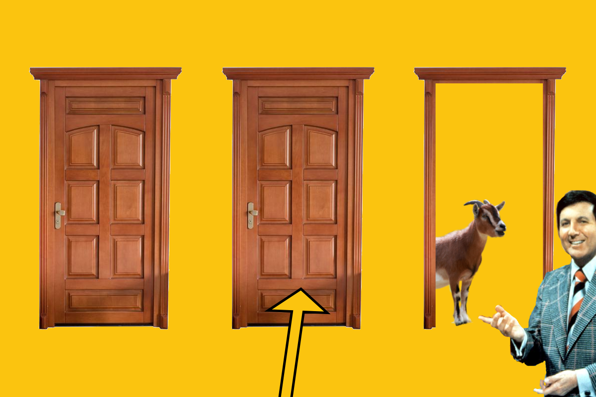
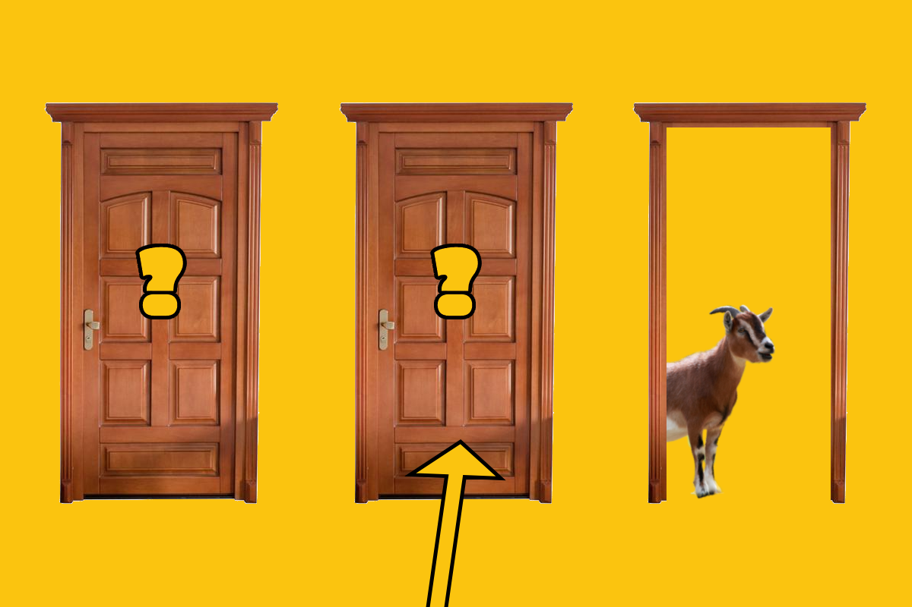
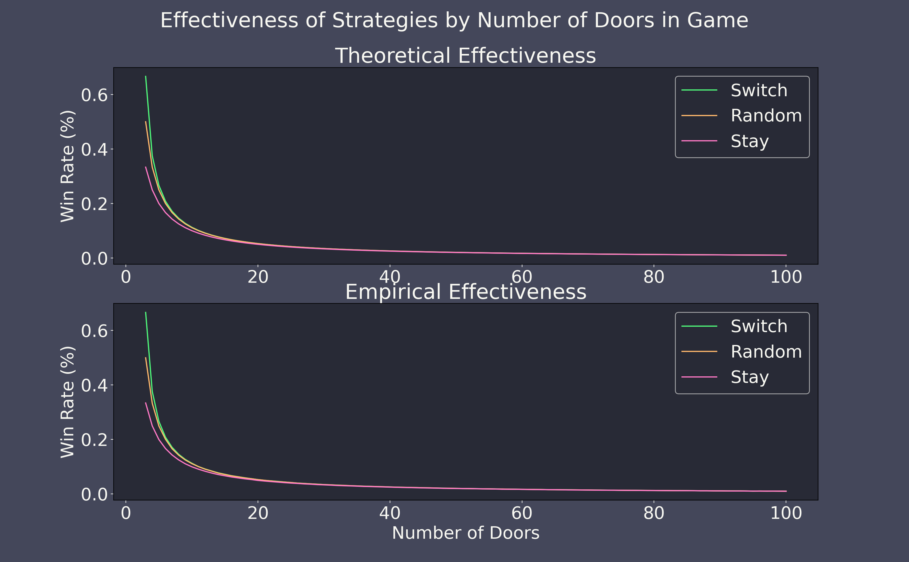

#### June 13th, 2021

In this post, I will go over the basics of the Monty Hall problem and dive into some deeper problems that I came across during the course of writing. Additionally, I have created a Monty Hall simulator in Java for verifying my math and for experimentation. You can find the link to the GitHub at the conclusion of the post.

## Background
The Monty Hall Problem comes from the game show *Let's Make a Deal*. During the show, the host, the titular Monty Hall, presents the contestants with three doors. Two of the doors each hide a goat, and behind one door is a car. The contestant's goal is to select the door that hides the car, but there is a bit of a twist.

First, the contestant selects one of the doors. 

Next, Monty Hall opens up one of the two unselected doors. Monty will always open up a door with a goat behind it. If the contestant has already selected a door with a goat, Monty Hall is forced to open the only other door with a goat. If the contestant has initially selected the door with the car behind it, Monty will randomly select one of the other doors (both with goats) to open.

At this point, the contestant is given another choice: they can either stay with their current door or they can switch to the other unopened door. The contestant can either *stay* or *switch*.

So here's the question: what is the best strategy for the contestant to use if they want to maximize their chances of winning the car? Should you always stay or should you always switch? Or does it not matter? Is this decision actually a non-choice presented by an old game show to throw in a bit of excitement?

At this point, I would encourage you to pause and really think about what you think the solution to this puzzle is.

## Intuition
For me, and I'm guessing for many others, when I first heard this problem, it seemed like a non-choice - it doesn't matter what the contestant does. When Monty Hall opens the door and leaves two closed doors, the contestant has a 50-50 chance of winning. My brain tells me to ignore the lingo of "stay" and "switch". Those are just meant to confuse you! What you really have are 2 doors: one has a goat and one has a car, good luck.

But this isn't correct. It is not a 50-50 chance of winning a car. If you employ the best strategy, your chances actually increase to 2/3! How can this be? How can what seems to be a coin toss actually be heavily weighted towards one side? I think the answer to why our intuition is wrong will be more easily answered if we first figure out the correct solution.

## Simplify
Let's imagine the game is slightly different. Just like before, you select a door first and then Monty Hall reveals a goat from behind one of the other doors. However, in this game, you have no choice but to stay.

In this modified game, Monty Hall reveals what's behind the two unselected doors in succession but will always open a goat door first. He's dragging out the reveal for you and the audience. Well this painful display by the host would be no different than if he just immediately showed you what was behind your door (minus some fanfare). What would your odds be in this case? It's trivial: 1/3. In this game, you are simply randomly selecting from 3 doors.

This is obvious to us. What's not as obvious is that this version of the game lies within the original version. If you went into this game and knew that you were going to stay with your door no matter what, you would actually be playing this modified version of the game. You select a door; Monty reveals a door; you stubbornly stay with that lucky first door; you win 1/3 of the time.

By thinking this way, we can see that the stay strategy will win 1/3 of the time!

## The Best Strategy
Switching, as opposed to staying, is the only other strategy you could choose. Since probabilities must add up to 100%, we can conclude that this switching strategy will win you a brand new car 67% of the time. Wow!

Ok, so by process of elimination we have determined the best strategy, but perhaps this leaves something to be desired. Why does switching give you such good odds. Let's look at it another way.

Starting at the beginning again, you select a door from the 3. You have a 1/3 chance of having selected the car and 2/3 chance of having selected a goat.

Let's say you have selected a goat first (2/3 chance). At this point, Monty will be forced to open the other, unselected door that has a goat behind it. After this reveal, the other door that you did not select will *always* hide the car. Therefore, if you choose the switch strategy after having originally selected a goat, you will be switching to the car! The only thing you must do to win with the switch strategy is pick a goat originally, which you will do 2/3 of the time.

Put more simply: if you pick a goat and switch, you will win. If you pick the car and switch, you will lose. Since you will pick a goat 2/3 of the time, switching wins 2/3 of the time.

## Why was I so wrong?
At this point in my understanding, one question remained, why did I get this wrong? Perhaps a more insightful question to ask would be, what essential part of this problem did I overlook? This can be answered by creating a game in which my initial intuition was correct; that is, a game in which the strategy does not matter.

Let's alter the original *Let's Make a Deal* game. In our new game, we'll replace the reliable Monty Hall with a new host, Dory. Dory is an entertaining host, but she has one problem: she can't remember which door contains the car. When it comes time to reveal one of the doors, she knows that she shouldn't reveal what's behind the door you've selected, but she's at a loss as to which remaining door to open. Therefore, she reveals one of the doors at random. 

What are our odds with this new host? Let's again examine each scenario. If we have selected a goat door at first, there is then a 50-50 chance that Dory will mistakenly reveal the car. This situation will occur `2/3 * 1/2 = 1/3` of the time. If this happens, we can switch to the car door and win easily. 

However, if Dory reveals a goat to us, we can not make any stastical claim about what lies behind any of the unopened doors. This is because the randomness of Dory's decision reveals no information about the state of the game. The likelihood that we selected the car and Dory revealed a goat is `1/3 * 1/1 = 1/3`. And equally likely is the scenario that we selected a goat door and Dory randomly opened the other goat door `2/3 * 1/2 = 1/3`. This all means that when we see a goat door revealed to us, we learn nothing and must make a completely random guess.

For completeness, we can note that with Dory as the host, we will still win 2/3 of the time: Dory will reveal the car 1/3 of the time and will reveal a goat 2/3 of the time, which will leave us with a 50-50 chance of getting the car.

What we should note here is that in the case in which Dory randomly picks a goat door, we have reached the same stage of the game as with Monty Hall; namely, we need to stay or switch our door. However, with Dory as the host, we have only a 50% chance of selecting correctly, but with Monty, we can achieve a 66% chance of winning. Why?

The answer is that randomness contains no information. With Dory as the host, when we must stay or switch on our door, the statistical scenario is exactly the same as having to randomly select from two doors with no previous information. All of the fanfare that came before with Dory as the host is meaningless noise. We have nothing to learn from her random choices. With Monty as the host, the situation is different. The preamble to the final decision is not meaningless. When Monty is the host and we initially select a door with a goat behind it, which would happen 2/3 of the time, Monty's actions are predefined by the rules of the game. The fact that Monty was constrained in his decision (i.e. that he did not decide the door at random), means there is something for us to learn about our odds. Ultimately, what matters when trying to make such a decision is understanding all of the actions of the other agents in the game. Dory is a black hole of randomness; no knowledge can be extracted from her decision. Monty cannot always hide information in the same way. The algorithm that defines Monty's behavior allow us to make a statistically informed decision.

## A Note on the Host's Algorithm
An interesting question that can arise when analyzing this game may be how the host determines which door to open, the host algorithm. Let's change the rules of the game a bit. In this new version of *Let's Make a Deal*, the host can reveal any door that she wishes to. After the revelation, the contestant can choose any of the three doors, including the revealed one.

With this new game, what algorithm should the host employ to minimize the contestant's chances of winning? The only caveat is that the host must communicate the algorithm she will use to the contestant before the game begins. As we've already discussed above, Monty Hall and Dory's algorithm both result in a 2/3 chance of the contestant winning if the contestant employs the optimal strategy.

What if the host employs simply full randomness? The host will reveal any door at random. The host gives no regard for which door contains the car nor which door the contestant has selected. But this fully random host falls prey to the same issues as Dory. 1/3 of the time this host will reveal the car and the remaining time the contestant will still get a 50-50 chance of selecting the door, ultimately resulting in a 2/3 win rate. 

Similarly, if the host always reveals the door that the contestant has initially selected, the contestant will win 2/3 of the time because the host is 1/3 of the time revealing the car and giving the contestant a 50-50 chance the rest of the time.

Let's try to be more maniacal. In this next strategy the host will reveal the contestant's selected door if they have selected a goat but a different door randomly if they have selected a car. This sounds promising but the information that has been revealed by the selection gives the contestant an edge. If the contestant employs the optimal strategy, they will win 2/3 of the time again. If the host reveals a door that the contestant didn't select, then the contestant knows the selected door will always win. This is because the contestant knows that if the host reveals a different door than the selected one, the selected door *must* contain the car. If the selected door is revealed, then the contestant still has a 50-50 chance between the two remaining doors. By knowing this, the contestant can still win 2/3 of the time.

But all hope is not lost for the host. By combining randomness with our previous algorithm we can achieve something better. Let's define our new strategy as:
- If the contestant has selected the car, randomly pick from the other two doors which to reveal
- If the contestant has selected a goat:
  - 50% of the time, reveal the door the contestant has selected
  - 50% of the time, reveal the unselected door with the goat

In this algorithm, the contestant never gets a free win by having the car revealed to them and the minimal amount of information is passed onto them because their is randomness in the selection process. Let's consider the scenarios.

After selecting the initial door, the host then reveals the selected door (a goat) to the contestant. What is the best strategy at this point? Well, the contestant has learned nothing about the other two doors still, so they have a 50-50 chance of winning. If a different, unselected door (and a goat) is revealed to the contestant, they must reason about which of the situations they are in: have they selected the car door and now the host has randomly decided between the two remaining doors OR have they selected a goat door and the host has then randomly decided to open a different door anyways? They should employ a strategy based upon the probabilities of it being each scenario, but here the contestant fails. There is a 1/3 chance that they chose the car originally, and in such a case, the host would be obligated to choose a different door. However, there is still a `2/3 * 1/2 = 1/3` chance that they selected a goat originally and the host has randomly decided to open another goat door anyways. The contestant is in a bind: both scenarios are equally likely. Therefore, the contestant faces another 50-50 choice, to stay or to switch. If the host uses this algorithm, the best the contestant can do is win 1/2 the time.

## Looking at the math
While writing up this article, I simulated all of the contestant and host strategies. One variable that I found fun to play around with was the number of doors (`n`) that the game contained. Typically, the game was played with 3 doors and a single one being revealed by Monty Hall, but what if the game started with 50 doors and a single one was revealed. Thinking about it this way can give a different perspective on the original paradox. We can define the probabilities of winning with each strategy when playing with `n` doors.

- Random Strategy:
  - After a single door is revealed, there will be `n-1` doors to select from. Since the selection is uniformly random, the contestant's chances are `1/(n-1)`
- Stay Strategy:
  - After a single door is revealed, the contestant sticks with the original choice and the original odds: `1/n`
- Switch Strategy:
  - For this strategy, we have to consider different probabilities. If the contestant didn't select the car (`n-1/n` chance of this), then the likelihood of winning is `1/n-2` (`n-2` in this case because the contestant knows the car isn't behind the selected door or the revealed door.). If the contestant did select the car (`1/n` chance of this), then they have no chance of winning. This results in the ultimate odds of (`1/n * 0 + (n-1)/n * 1/(n-2) = (n-1)/(n*(n-2))`. If we plug in 3 for `n` like in the normal variation of the game, we can see the odds work out to what we calculated above: `(3-1)/(3*(3-2) = 2/(3*1) = 2/3`.

**Figure 1.** This chart shows the probability of winning against Monty Hall when employing the three strategies discussed with a variable amount of doors. The upper plot shows the theoretical effectiveness, and the lower plot shows the empirical effectiveness after simulating the game 1,000,000 times with each strategy and each number of doors. You can see that the effeciveness of the three strategies converges as `n` approches infinity.

## Code

[REPO](https://github.com/mmcbrien3/MontyHallJava)
