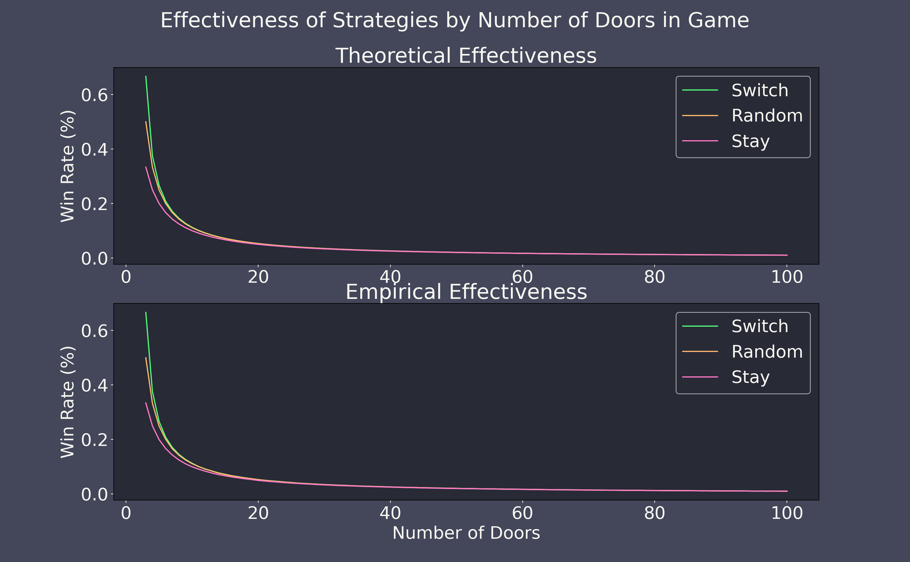

# Yet Another Monty Hall Simulation (YAMHS)

The Monty Hall Problem is a popular statistical puzzle because it is easy to explain and is so counterintuitive. The solution I thought of when I first heard this problem shouted out loudly as the only possibility. The answer seemed so obvious, yet I was so wrong. And this is clearly the case for many people as it has spurred many a youtube video and internet article.

## Background
The Monty Hall Problem has to do with the game show Let's Make a Deal. During the show, the host, the titular Monty Hall, presents the contestants with 3 doors. Behind 2 of the doors is a goat and behind 1 door is a car. The contestant's goal is to select the door that hides the car, but there is a bit of a twist.

First, the contestant selects one of the doors. Next, Monty Hall opens up one of the two unselected doors. Monty will always open up a door with a goat behind it. If the contestant has already selected a door with a goat, Monty Hall is forced to open the only other door with a goat. If the contestant has initially selected the door with the car behind it, Monty will randomly select one of the other doors (both with goats) to open.

At this point, the contestant is given another choice: they can either stay with their current door or they can switch to the other unopened door.

So here's the question: what is the best strategy to employ at this point? Should you always stay or should you always switch? Or does it not matter? Is this really a non-choice presented by an old game show to throw in a bit of excitement?

## Intuition
For me, and I'm guessing for many others, when I first heard this problem, it seemed like a non-choice - it doesn't matter what the contestant does. When Monty Hall opens the door and leaves two closed doors, the game has changed to a coin toss, 50-50 chance. My brain tells me to ignore the lingo of "stay" and "switch". Those are just meant to confuse you! What you really have are 2 doors. One has a goat and one has a car, good luck.

But this isn't correct. It is not a 50-50 chance of winning a car. If you employ the best strategy, your chances actually increase to 2/3 chance! How can this be? How can what seems to be a coin toss actually be heavily weighted towards one side? I think the answer to why our intuition is wrong will be more easily answered if we first figure out the correct solution.

## Simplify
Let's imagine the game is sligthly different. Just like before, you select a door first and then Monty Hall reveals a goat from behind one of the other doors. However, in this game, you have no choice but to stay. Monty Hall reveals what's behind the other two doors slowly in succession but will always open a goat door first. He's making it an agonizing reveal for you and the audience. Well this painful display by the host would be no different than if he just immediately showed you what was behind your door (minus some fanfare). What would your odds be in this case? It's trival: 1/3. In this game, you are simply randomly selecting from 3 doors and you have absolutely no outside knowledge.

This is obvious to us. What's not as obvious is that this version of the game lies within the original version. If you went into this game and knew that you were going to stay with your door no matter what, you would actually be playing this modified version of the game. You select a door; Monty reveals a door; you stubbornly stay with that lucky first door; you win 1/3 of the time.

Well, wait a second, here is some insight. If this was really a 50-50 chance, how could one of the options, namely staying with your door, give you only a 33% chance of winning?

## The Best Strategy
Switching, as opposed to staying, is the only other strategy you could choose. Since we all know that probabilities must add up to 100%, we can conclude that this switching strategy will win you a brand new car 67% of the time. Wow!

Ok, so by process of elimination we have determined the best strategy, but perhaps this leaves something to be desired. Why does switching give you such good odds. Let's look at it another way. Starting at the beginning again, you select a door from the 3. You have a 1/3 chance of having selected the car. Put another way, this means that you have a 2/3 chance of having not selected the car. Put another another way, there is a 2/3 chance of the car being behind one of the remaining, unselected doors.

Now, Monty opens one of the doors. What has changed? Have your odds of having selected the door with the car magically jumped to 50%? No. Monty will always, always, always select a door with a goat so your original selection is doing no better. However, we still know that there was a 2/3 chance of the car being behind one of the 2 doors you didn't select. Since Monty has opened one of the doors and we have learned that the car isn't behind that door, we now know that if the car isn't behind one of the doors you selected (2/3 chance) then there is a 100% chance it is behind this final door. 2/3 * 1/1 = 2/3.

## Why was I so wrong?

## Looking at the math

### Appendix
[REPO](https://github.com/mmcbrien3/MontyHallJava)
