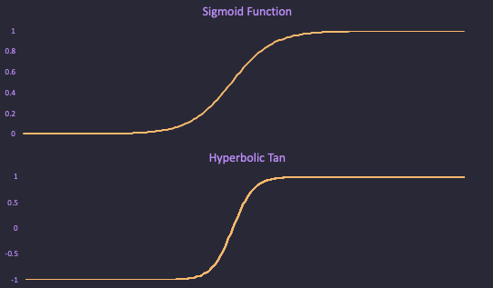

## A Brief Intro to Neural Nets
### with interactive nets!
#### April 9th, 2023

This essay will briefly go over how neural networks work. This covers
the activation process of a neural network but does not cover how
machine learning is used to train neural networks (e.g. back propagation).

### Background

Neural nets are so called because they are meant to mimic how neurons work in the brain. Each
network is composed of layers and each layer is composed of individual nodes. In the brain analogy,
each neuron is represented by a node and the synapses between the neurons are the connections
between the nodes. Each node will activate -- neuron will fire -- based on the signals it is receiving.

By altering the connections between the nodes and the structure of the network, 
we can create networks that express complicated functions.

Neural nets have been used to great effect in machine learning from simple regression and classification
to even [ChatGPT](https://en.wikipedia.org/wiki/ChatGPT), which is
essentially a very large, very specific type of neural network.

### Structure

All networks are divided into three parts:

1. The input layer
2. The hidden layers
3. The output layer

The input layer represents the inputs to the neural network. The output layer
represents the output of the neural network. The input layer and output layer
are connected by the hidden layers and there can be 0 to infinity hidden layers.

In most neural networks, each layer is fully connected to the layer in front of it. This
means that each node in each layer is connected to each node in the next layer. As an example,
see the neural network below.

This neural network has an input layer with two nodes, a single hidden layer with three nodes,
and an output layer with a single node (the structure of the network is from left to right).

<canvas id="exampleCanvas" class="resizingCanvas"></canvas>

### Weights and Biases

Every connection between two nodes in a neural network
has a "weight". These weights are a parameter of the neural network and are adjusted
as part of neural network training.

Each hidden layer node can also have a "bias". Biases are a less common feature of neural networks.
The biases are also a parameter of the neural and are adjusted as part of neural network training.

### Activation

Each node in a neural network is assigned a value. The input layer's nodes values
are assigned simply by the input to the neural network, no special math is required.

For all other nodes, you use something called an "activation function" to determine its value.
An activation function maps an input of a neural network node to an output within some range,
typically in the range (0, 1) or (-1, 1).

Two common activation functions are the "sigmoid" function and the "hyperbolic tan".

$$
\text{sigmoid}(x) = \frac{1}{1 + e^{-x}}
\\
\text{hyperbolicTan}(x) = \tanh(x)
$$

Once an activation function is determined, you can use the following to determine
the value at each node:

$$
\text{activation}(x) = a(x)
\\
\text{bias at current node} = b
\\
\text{set of upstream nodes} = u
\\
\text{set of upstream weights} = w
\\
\text{input to activation} = a_{\text{input}} = \sum_{i=0}^{|u|}{(w_i * u_i)} + b
\\
\text{value for current node} = a(a_{\text{input}})
$$

What this is saying in English is to take all of the connections
between the nodes upstream of this node that are connected to the current node.
Take the value at each of these nodes and multiply it by the weight of the
relevant connection. Take the sum of these values and add the bias. The result
of this operation is then fed into the activation function, which gives the final
value for the node.

A node, therefore, can only have it's value determined when all of the upstream
nodes of it have their values determined. First the input layer's value are determined trivially
(i.e. no upstream calculation is required). Then these values are used in
determining the values in the first hidden layer and so on. These types of networks are sometimes
called "feed forward" networks since the values must be calculated left to right.

#### Activation Example

Let's consider a node like the following below. This node has two incoming connections. 
The first connection has an upstream value of `0.5` and a weight of `0.25`. The second
connection has an upstream value of `0.1` and an weight of `2.0`.

The node has a bias of `0.05` and the activation function being used in the "hyperbolic tan".
With all of this, we can calculate the value of the node.

$$
\text{input to activation} = a_{\text{input}} = \sum_{i=0}^{|u|}{(w_i * u_i)} + b
\\
a_{\text{input}} = (0.5 * 0.25 + 0.1 * 2.0) + 0.05 = 0.375
\\
\text{value for current node} = \tanh(a_{\text{input}}) = 0.36
$$

### Interactive Nets

To show how this all fits together, the following are two neural networks that can
be adjusted. By clicking on an input node, the value of that node is incremented.
By clicking on a node in the hidden layer, the bias of that node is incremented by 1.

The value of the node is represented by the green, filled circle and the value of the bias
is represented by the red, outline.

For simplicity, the weights cannot be adjusted and the value of each weight is 1.

The activation function in each network is the "hyperbolic tan".

#### Basic Net

<canvas id="simpleCanvas" class="resizingCanvas"></canvas>

#### Complex Net

<canvas id="nnCanvas" class="resizingCanvas"></canvas>

