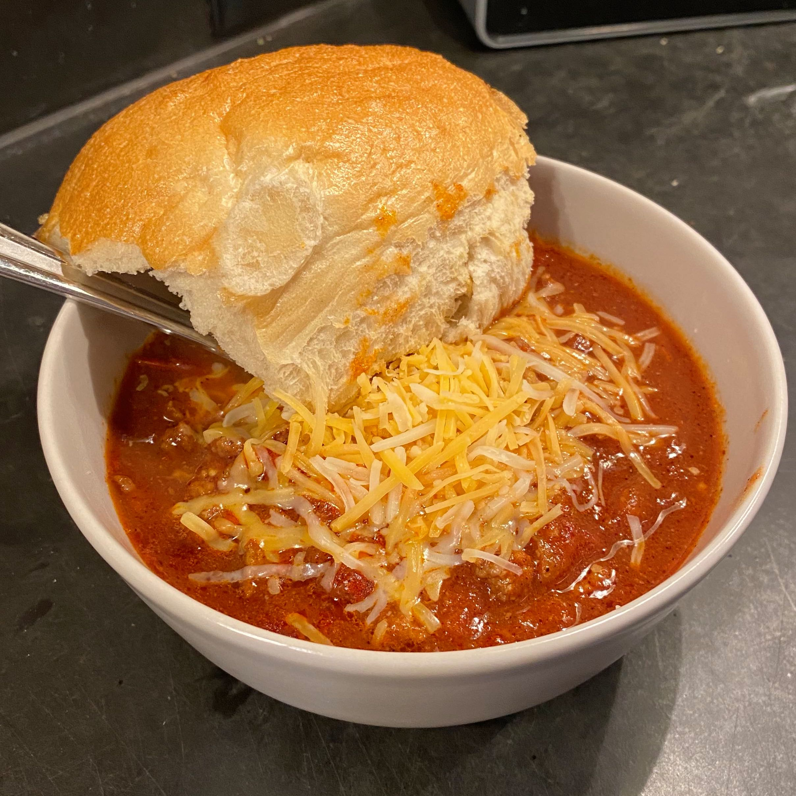
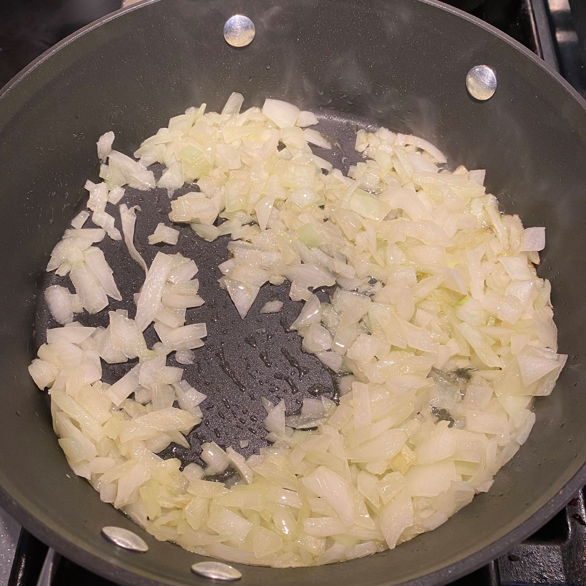
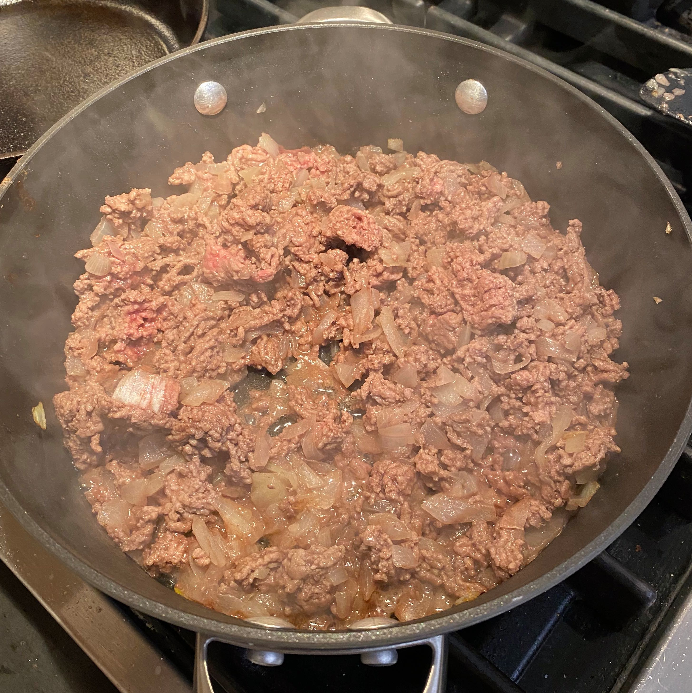
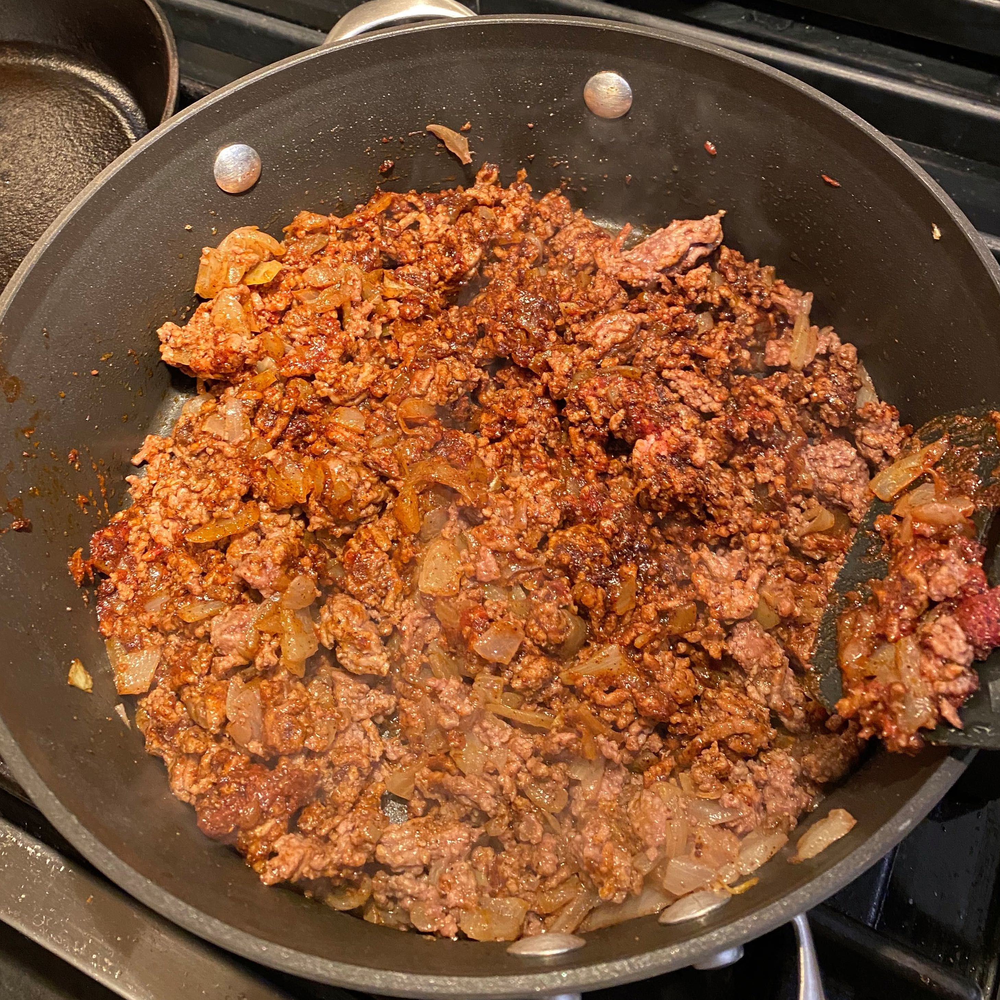
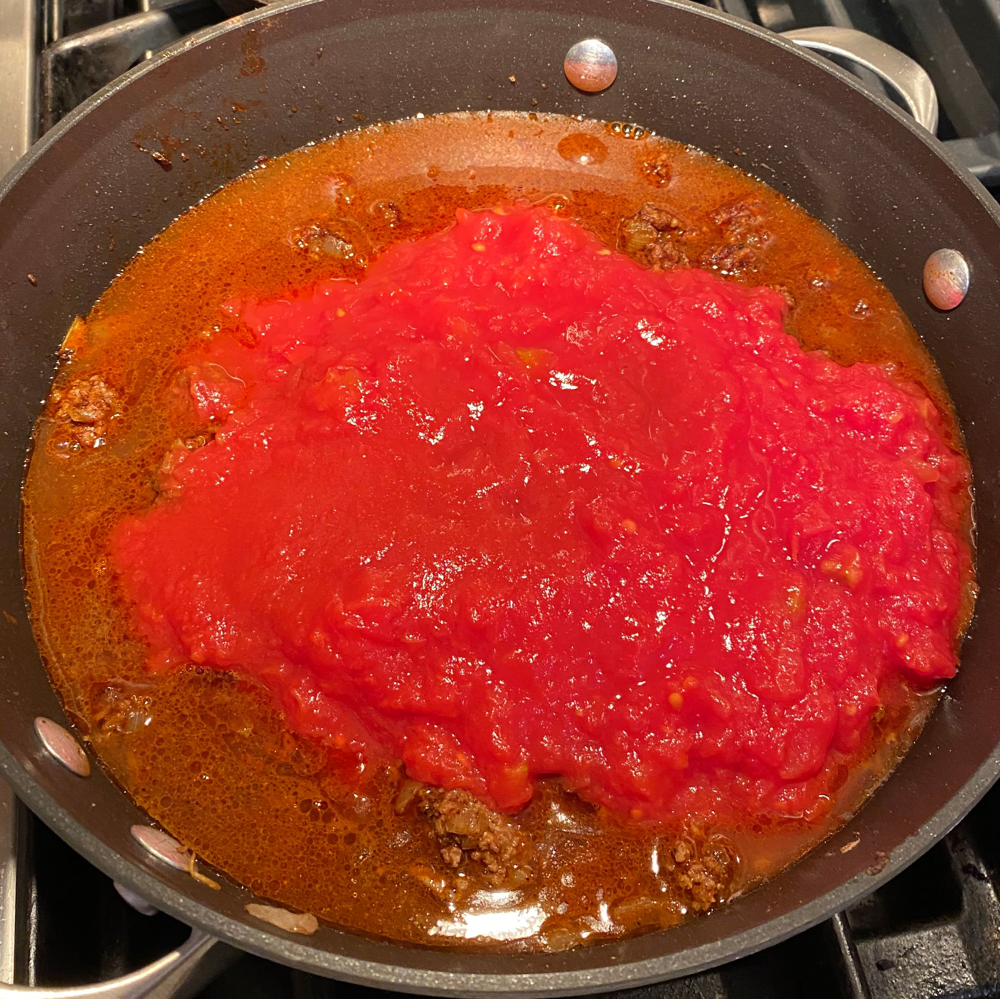
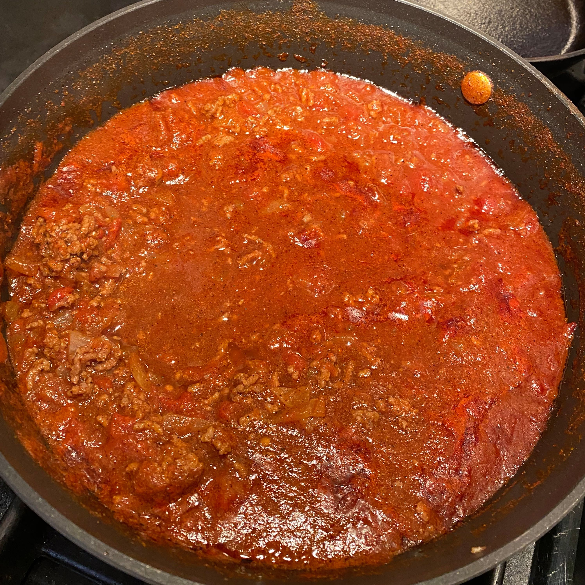
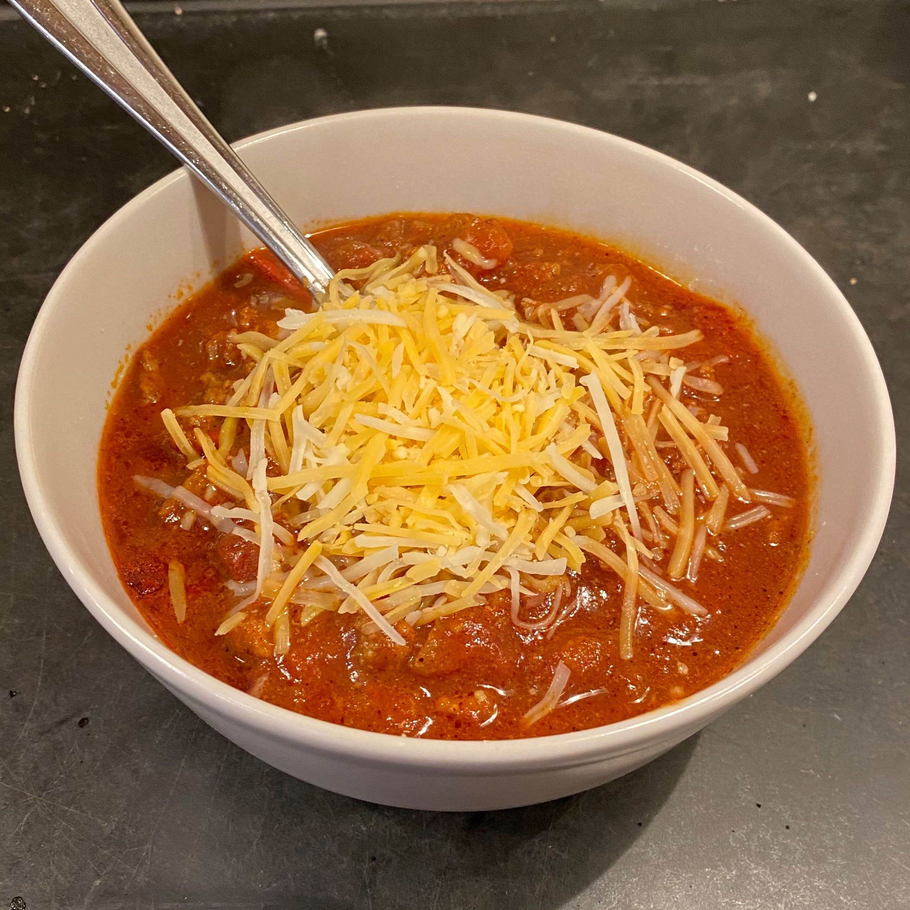

-
layout: default
---

# Beef Chili 

There is nothing like a big bowl of beef chili, smothered in shredded cheese, and garnished with a large roll. I never feel a need for the beans, and I didn't include them in this dish.

I followed [this recipe](https://www.thewholesomedish.com/the-best-classic-chili/)

Rating:
  - Dish: A-
  - Execution: B+

### Ingredients

- Ground beef
- Chopped onions
- Olive oil
- Chili powder
- Cumin
- Sugar
- Garlic powder
- Salt
- Pepper
- Tomato paste
- Beef broth
- Diced tomatoes
- Tomato sauce

### Logs

This is a pretty straightforward dish -- no fancy skils required. Chop onions, mash beef, add flavor, mix ingredients, heat pot. Still, a hearty bowl of homeamade chili is delicious and heartwarming. First thing to remember is to put the onions in first to soften them up. Remember the old adage that I just made up: "You can't overook onions if they are going in the chili."

 | 
-|-
|

One great aspect of this dish, lending to its ease, is the high "to-taste" factor. You can basically put any combination of ingredients at any volume and it will still be chili. It may turn out too salty or too spicy, but that's half the fun.

 | 
-|-
|

Once you add the beef broth you may think to yourself, "Am I making soup?? I thought I was making chili!" Well, don't fret. Once you add the tomato-y ingredients (paste, sauce, diced), things will thicken up nicely. After leaving on the heat for a bit, it should round the corner and turn into something resembling chili. For this particular manifestiation of chili, I was a bit low on the tomato sauce and paste, but things still turned out ok.

 | 
-|-
|

Lastly, serve your chili in a bowl and top with your favorites. For me, it's some shredded cheese and a warm roll.
