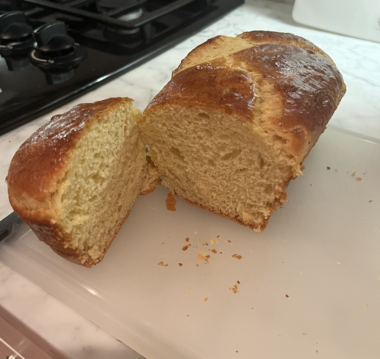
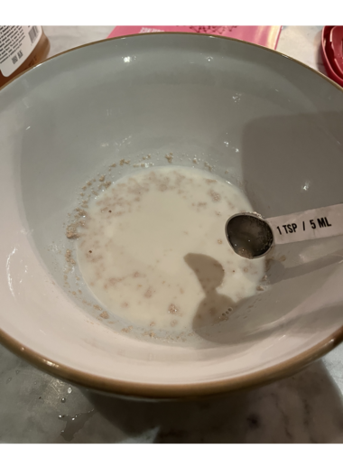
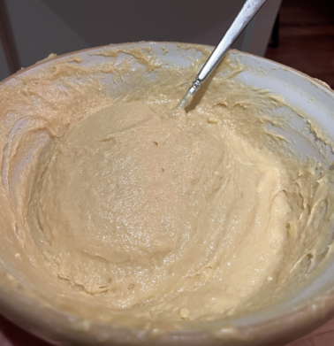
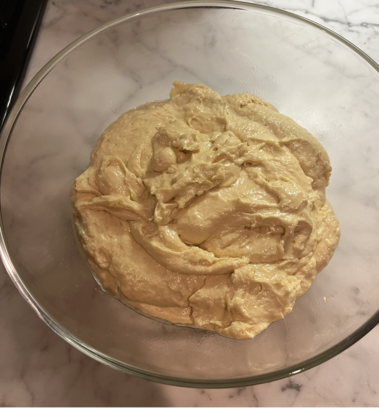
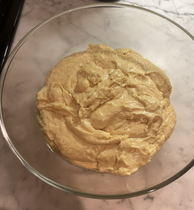
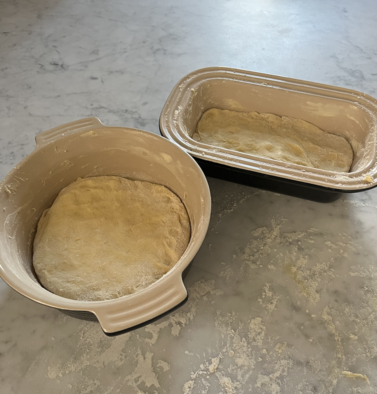
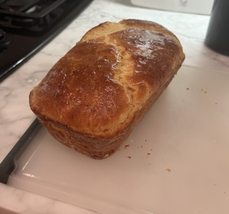
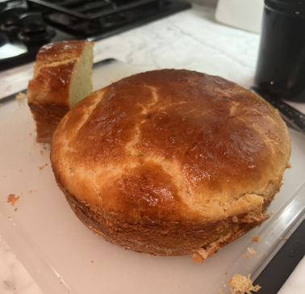
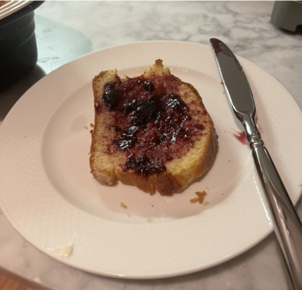

# Brioche (September 2023)

This is now a bread making page. I haven't had so much enjoyment out of making a food as I have out of this. There was much more effort and patience required than normal, but the process and the end result were both satisfying.

I mostly followed [this recipe](https://www.theflavorbender.com/brioche-bread-recipe/) but I took inspiration when stuck from [this page]() as well

Rating:
- Dish: A
- Execution: B

### Ingredients

- Eggs
- Instant yeast
- Butter
- Milk
- Vanilla
- Honey
- Salt
- Sugar
- ~~Bread flour~~ All purpose flour

### Logs

I started on this journey confidently but that was shaken multiple times throughout. I have attempted making bread once before and instead of making a light, yummy loaf I made a dense, flat brick of flour. I was hoping for better this time.

A big hurdle I had to clear was my lack of electric mixer of any kind -- hand or stand. This meant I mixed everything by hand. I would really not recommend this because there are steps of the recipe that require mixing on "medium speed" on a stand mixer for tens of minutes. My arms were exhausted and I certainly did not mix this as thoroughly as I needed to. Nevertheless, I worked as hard as I could until I decided I had technically reached the necessary criteria for stopping. The recipes say you are done mixing when you can pull on the dough and it stays together long enough and becomes thing enough that a bit of light can be seen through the dough. This is dubbed the "window pane" test. My dough would've gotten a D- on the window pane test, but I figured that was better than an F and my arms were too sore to continue.

|-|-|
|

The next step was a two hour proof at room temperature. The recipe instructed me to shape dough into a ball and put it into a container that is large enough for it to triple in size. While my dough was so gloppy that it was hard to shape into a ball, I was hopeful that the proof would be in the proofing. After about 70 minutes of proofing, my dough had not moved at all. I decided I should take it out of the bowl and try to re-shape it into a bowl. I threw it onto a floured surface hoping a bit of extra flour would make things easier. This was a huge failure and resulted in sticky hands and an unruly mess remaining. I threw everything back in the bowl and considered throwing the concotion in the trash. I decided I might as well follow the next step since it was just to cover it and put it in the fridge overnight.

These two photos were taken during the firs proofing when I was trying to convince myself something was changing. As you can tell, they look quite similar.

|-|-|
|

To my great astonishment, when I awoke in the morning, the dough was much much larger and was just touching the Saran wrap covering I had put on it. I left it in the fridge for the rest of the day and was hopeful I would have an edible bread.

When I returned home that night, I turned out the dough and it was now much more workable than the night before. I was able to shape it into two loaves without too much trouble. I let the loaves sit in the covered bread pans for a few hours before returning. Again, I could tell the dough had risen in the pans! 

I applied an egg wash and baked at 325 degrees for ~40 minutes. Again to my amazement popped out two beautiful loaves of bread. They even tasted quite good. Ultimately, I think my bread was still a bit thicker than normal brioche and it definitely had a bit of an extra egg taste. But the freshness still made it delicious. I'll try again soon, this time with electricity on my side.

|-|-|-|
||
