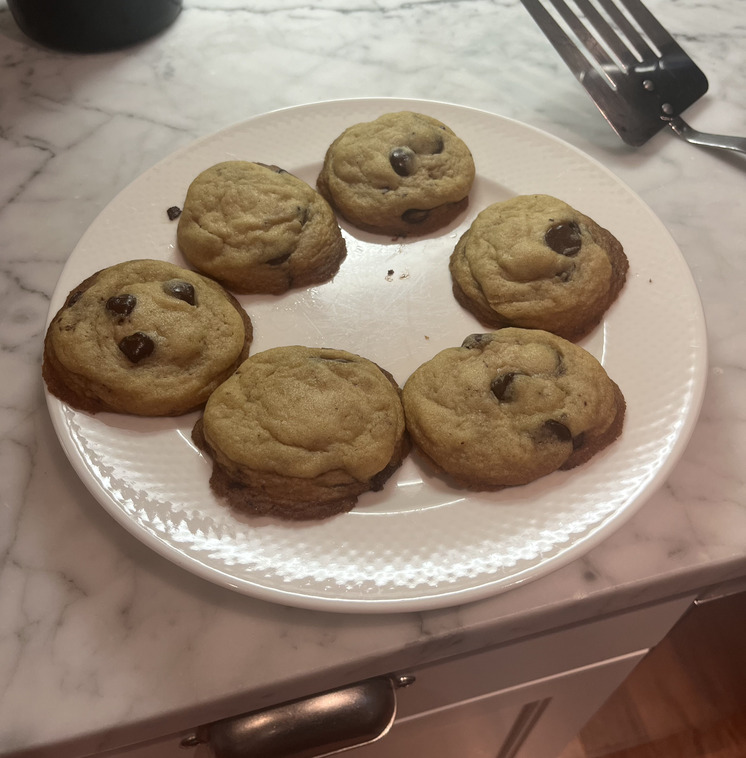
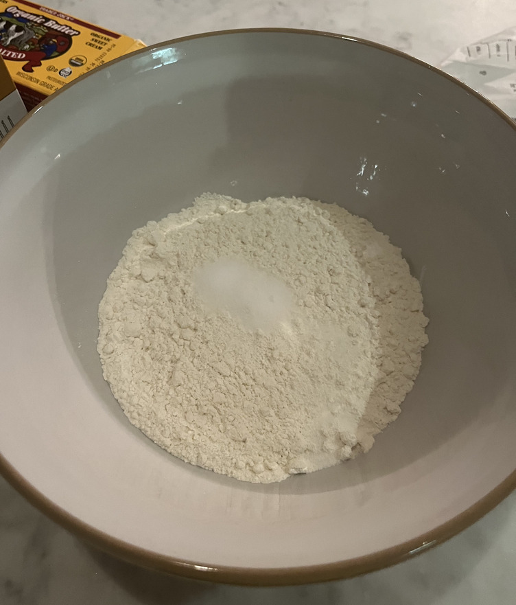
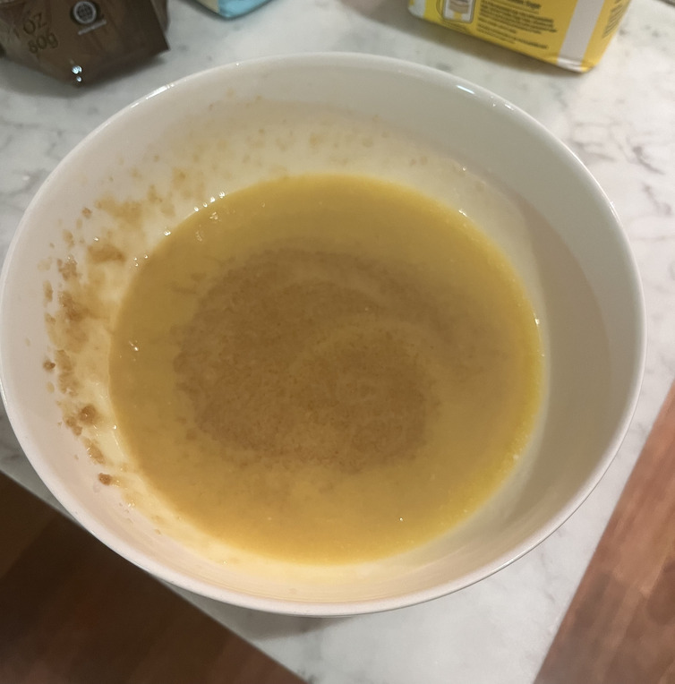
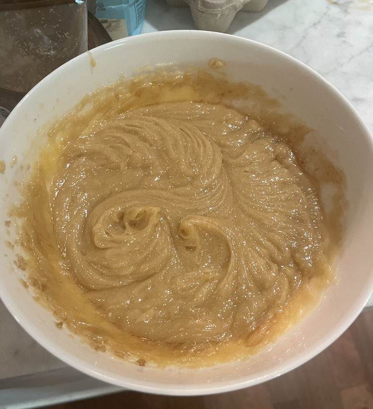
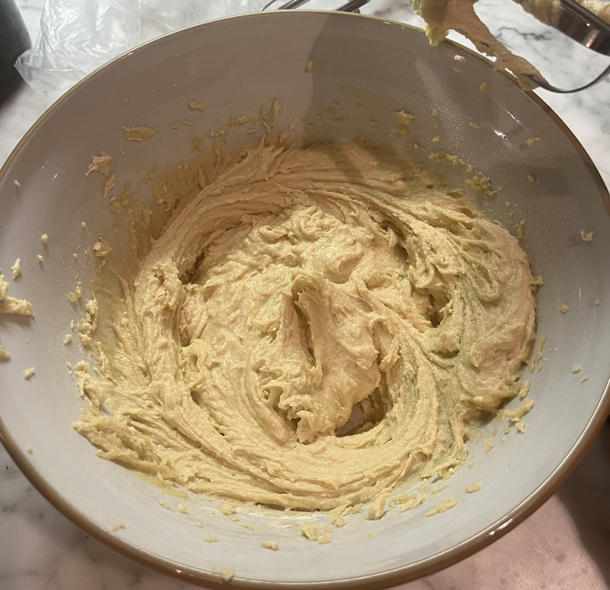
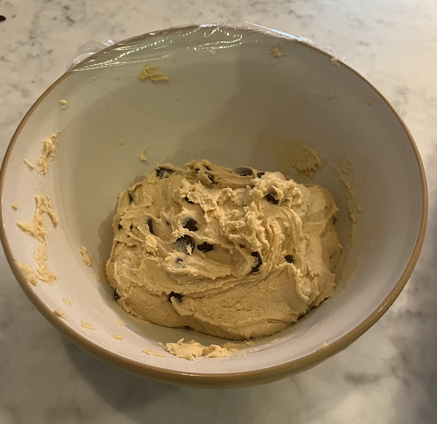

# Chocolate Chip Cookies (September 2023)

Life's short. Drink beer, eat chocolate chip cookies.

[This is the recipe I've been using](https://joyfoodsunshine.com/the-most-amazing-chocolate-chip-cookies/#wprm-recipe-container-8678) but I'm considering switching it up because it doesn't include the weights of the
ingredients. Maybe I just need to do it once and write everything down as I go.

Rating:
- Dish: A+
- Execution: A-

### Ingredients
- All purpose flour
- Vanilla
- Sugar
- Brown sugar
- Chocolate chips
- Baking soda
- Baking powder
- Salt
- Eggs
- Butter

### Logs
As long as you have the necessary ingredients, which you may well not have because most recipes require baking
soda (aside: what is "soda"?) and baking powder and vanilla, this is very easy to pull off. If you mix sugar,
butter, and vanilla together, it's going to taste good -- millennia of evolution have preordained it.

|-|-|
|

This isn't the first time I've made this recipe, but I have now invested in an electric mixer and it does make things
go much faster. Importantly, it goes so much faster that you can achieve the consistency you are actually supposed to
achieve before you get pissed off and just give up (especially relevant for more complicated baked goods).

|-|-|
|

I don't have too many comments or questions or notes to add here. Follow any recipe to combine things and it will come out
good. I've started trying to make my dough balls a bit more cylindrical than straight-up spherical, but I'm not sure
I'm convince this is much of an advantage.

I once made the cookies with half as many chocolate chips as the recipe called for and replaced that empty space with walnuts.
I loved them but your mileage may vary. Bake the cookies that you want to.