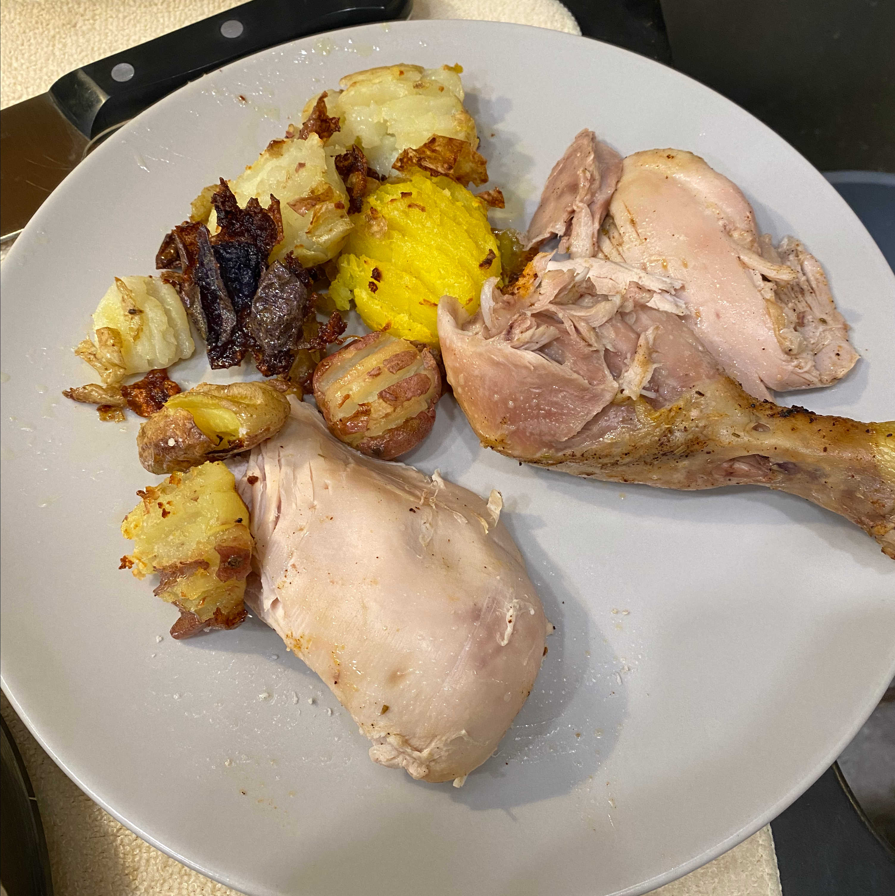
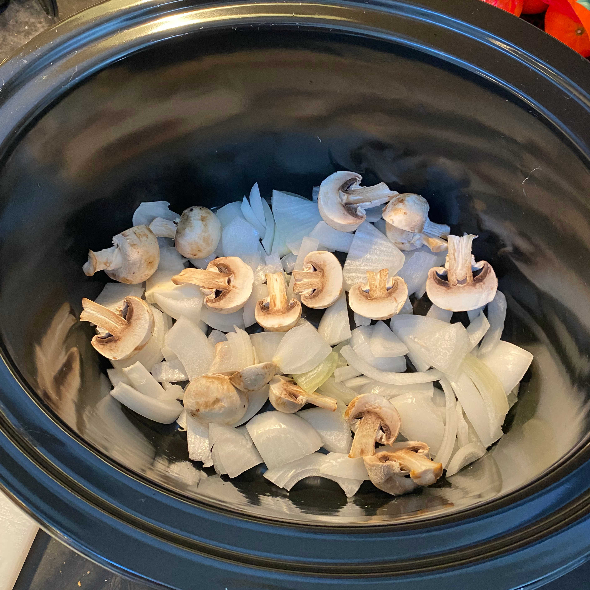
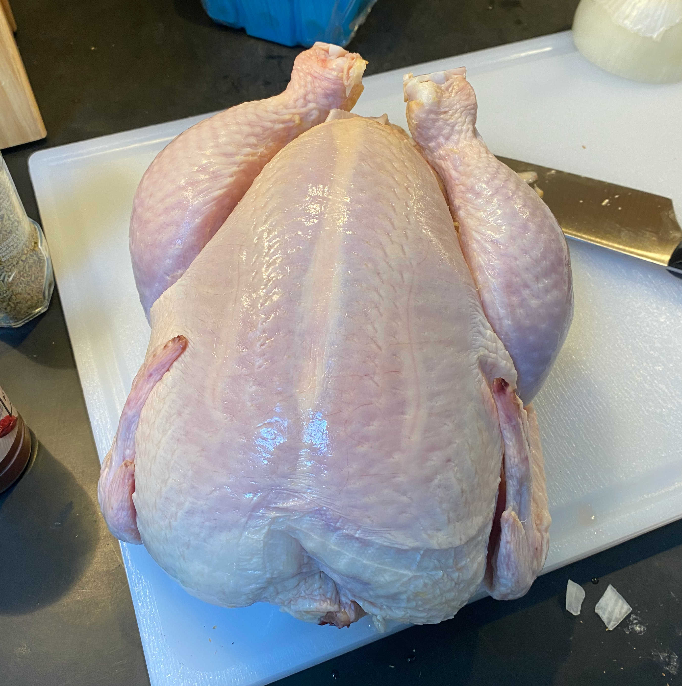
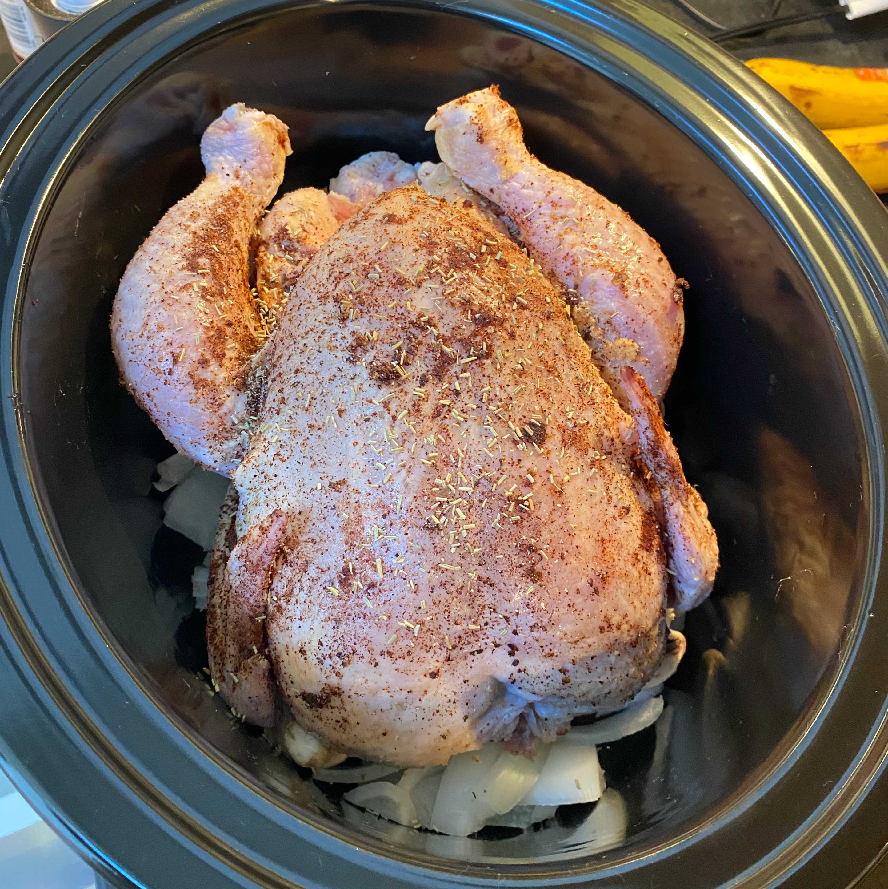
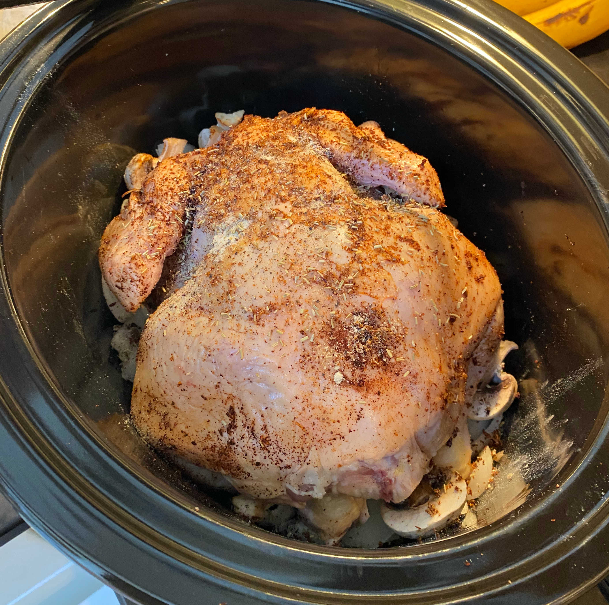
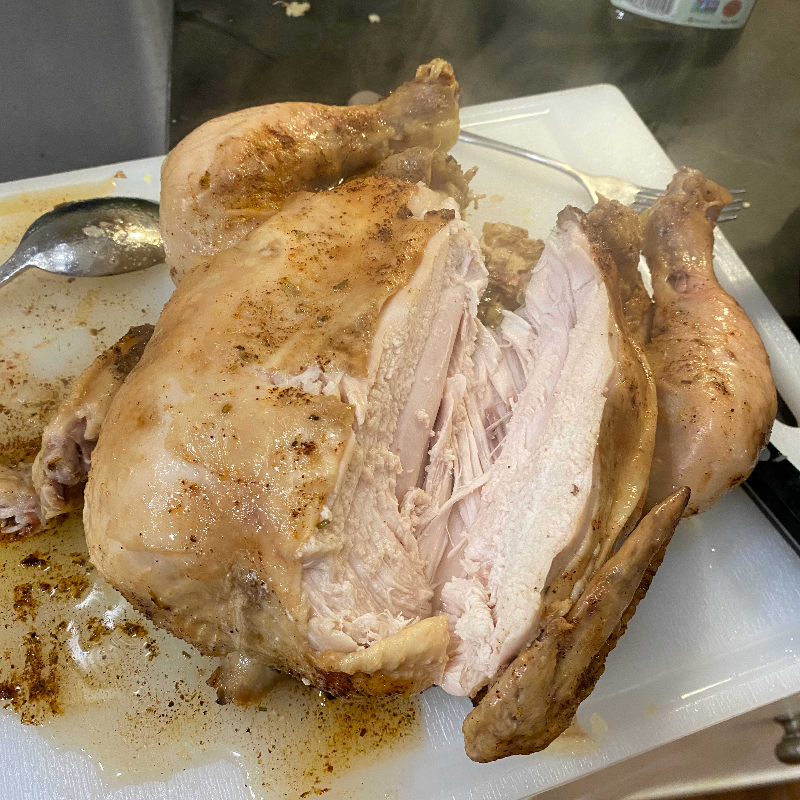
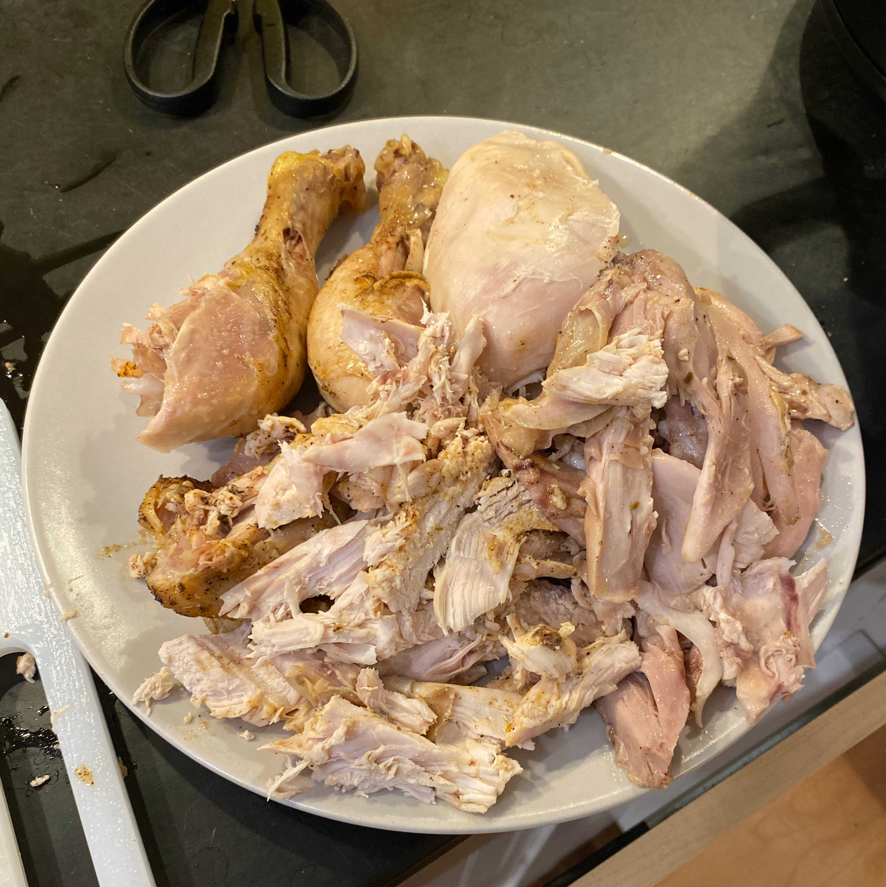

# Crockpot Chicken 

Making a whole chicken sounds daunting, but with a big enough crockpot, anything is possible. Waiting is the hardest part of this recipe!

I very loosely followed [this recipe](https://www.thewholesomedish.com/the-best-classic-chili/)

Rating:
  - Dish: A-
  - Execution: A-

### Ingredients

- Whole chicken
- Paprika
- Salt
- Pepper
- Brown sugar
- Garlic powder
- Onion powder
- Rosemary
- Lemon
- Mushrooms
- Onions
- Carrots
- Garlic

### Logs

My favorite part of making this dish is adding the whole vegetables to the bottom of the crock pot. You can just choose whatever vegetables you want to add some flavors. Onions? Carrots? Mushrooms? Garlic? All good! Toss them in as a bed to hold up the chicken. Similarly, your chicken dry rub can consist of pretty much anything to make it nice and yummy.

Oh and don't forget to take out the giblets!

|-|-|
|

The tricky part of this is identifying which side of the chicken is the breast. You want to put the breasts facing down in the crockpot so that the meat on the top is the fattier meat. So when the chicken is cooking, the fat will drip down onto the rest of the chicken. I thought it would be obvious to me which side was the breasts, but when I was holding that chicken in my hands, I realized that I know almost nothing about chickens. If you trust your instincts, you'll get it right. For reference, the drumsticks on the chicken should also be facing down and the correct orientation can be seen in the image below on the right.

|-|-|
|

Once everything is in the pot, just set the crockpot to high and wait 4 to 5 hours. After serving your time, you'll be rewarded with a juicy, flavorful chicken. But your task is not yet complete: you must carve the chicken up. I'm no expert on this, but it seems like knifing off the breast, pulling the drumsticks and legs off, and then going to town on the dark meat will be my modus operandi.

|-|-|
|

To me, this is the best homemade chicken I've ever eaten. Maybe cooking the chicken as a whole keeps some of that flavor in? Who knows; just enjoy.
