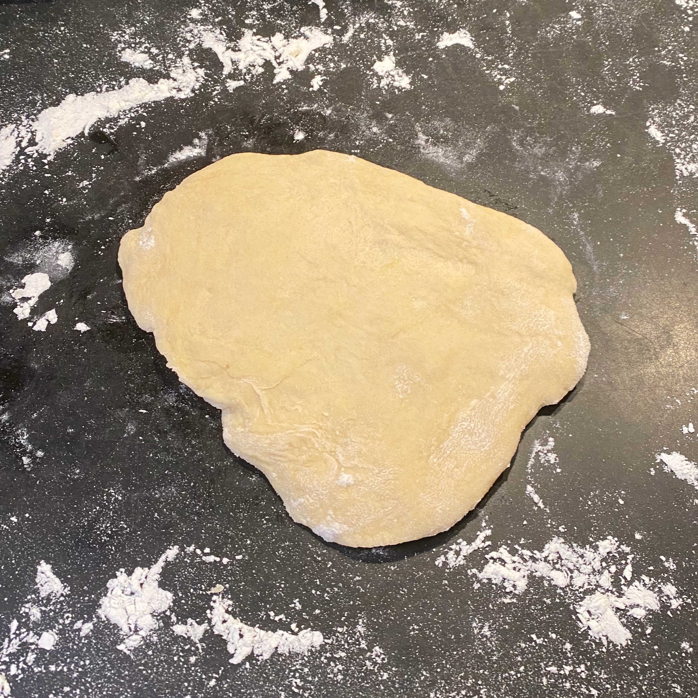

# Empanadas

I realized when I was making these small puffs of dough and meat, that they are a lot like those hand pies you find sometimes, typically filled with some sugar and some fruit. I am thinking now of the McDonald's apple pies, that are flaky and sweet and come wrapped in a paper box like a Christmas present. It was no surprise then that the translation of "empanada" - besides the first translation of just empanada - is turnover or pie.

I followed [this recipe](https://themodernproper.com/beef-empanadas).

- Rating
  - Dish: A
  - Execution: C+

### Ingredients

#### Meat Filling

- Diced russet potato
- Ground beef
- Onion
- Carrot
- Peas
- Minced garlic
- Beef broth
- Peas
- Salt
- Pepper
- Cumin
- Cinnamon
- Chili powder

#### Pie crust
- Flour
- Salt
- Butter
- Eggs
- Water

### Logs

When I set out to make these empanadas, my original plan was to make them with pre-made [discos](https://www.goya.com/en/products/empanada-dough/empanada-dough-for-baking#discos). However, I couldn't find any when I was hunting through the aisles at my local Safeway. That left me with a daunting task of making the crusts by hand. I had no confidence in my ability to do this because while I had watched my girlfriend make empanadas before, I had never made an empanada disco before and my baking skills are severely lacking.

Back at the house, I started by making the dough, which had to sit in the fridge for 30 minutes before being used. I don't have a full-on stand mixer, but I do have a hand mixer. Sadly, the lowest setting for this mixer is much faster than the slow, even churn of a standard stand mixer. While I didn't spill too much of the mix, the dough, as it coagulated, tended to climb up the blades of the mixer, creating a thick ball of goop that was hard to pry away from the machine. Eventually, I was able to get enough of the product off of the mixer and onto some aluminum foil for storage. I had no idea what empanada dough should look or feel like, but I guessed that I was in the general area of acceptability.

|-|-|-|
||

Once the dough was resting in the fridge, I got working on the filling. Based on my [Wikipedia research](https://en.wikipedia.org/wiki/Empanada), it seems like the type of empanadas I was making were most similar to what is typically described as Argentinian. The process of making the filling is pretty straightforward: dice and heat some potatoes, chop up some vegetables, heat up some ground beef. You add your ingredients to a big pot slowly over time and then spice it to taste. This part of the recipe was low stress, but I knew the true challenge was yet to come.

|-|-|-|
||

When the filling was nearly ready, I took the dough out of the fridge and started trying to turn dough balls into discos. The recipe I was following recommended to use a certain mass of dough to create a circular pie crust of a certain diameter. When I tried to achieve what the recipe was asking, I realized I wasn't able to form a circle as big as what was being asked for. (Note: I did not have a roller so was trying to do all of this by hand). Therefore, I had to use more dough per crust, leaving me with less empanadas than I was hoping for.

While I created asymmetrical, lumpy crusts, I figured they were still good enough to be tasty. Since I knew I had created less empanada crusts than I wanted, I tried to really stuff each one full of filling. This led to a lot of breakage and some unsightly lumps. After a lot of wrangling, a lot of egg wash being spilled on the counter, and some band-aid-like repairs to the tops of crusts, I was able to put together something I thought would be edible after being baked.

|-|-|
|

I then slided the tray into the oven and waited. After about ten minutes, I checked on my empanadas and I thought something was off. I was waiting for that flaky, brown crust to start appearing, but it looked like they were all still white and floury. I had forgotten to cover the tops in egg wash! I hurriedly pulled the empanadas out and doused them, blazing hot, in egg wash. I threw them back in the oven and hoped it would turn out. Sadly, I accidentally turned off the oven when I was performing the emergency egg-wash application and didn't notice for another ten minutes. The baking section of this recipe was a certified disaster.

Eventually, the empanadas were cooked and looked something like empanadas. They ended up being quite tasty, but they really could've used a bit of salsa on the side. All in, I really enjoyed making these little pocket-sized treats and I look forward to trying again.

|-|-|
|
