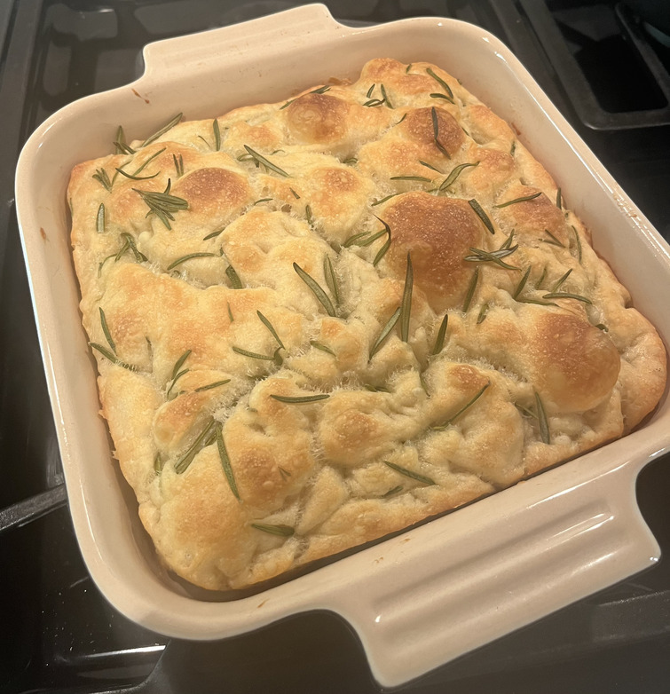
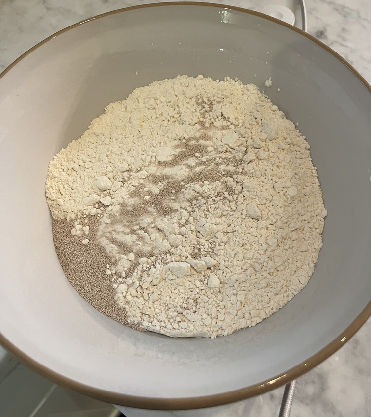
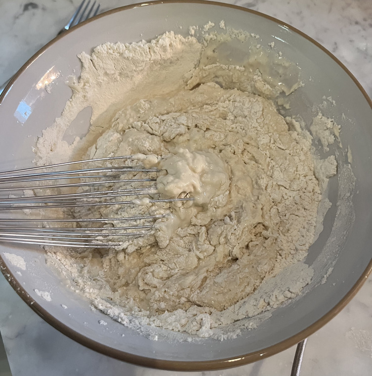
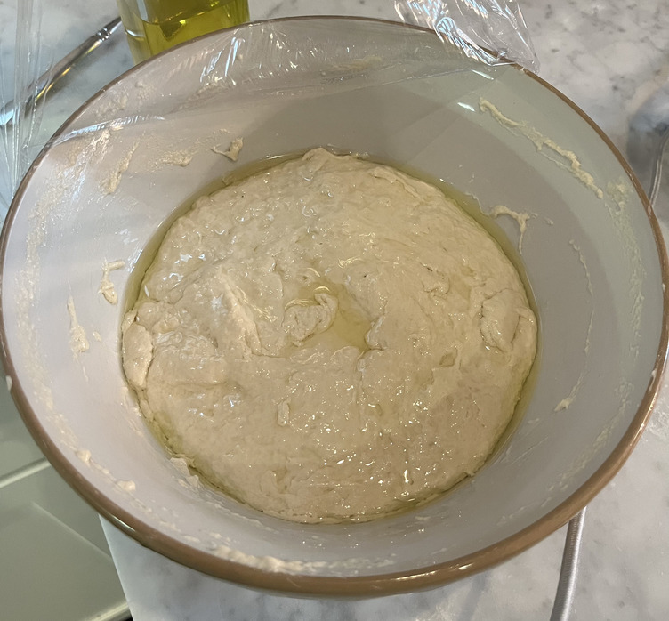
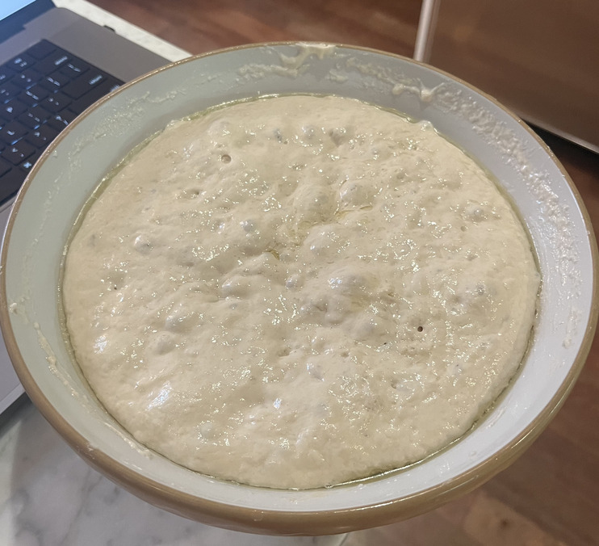
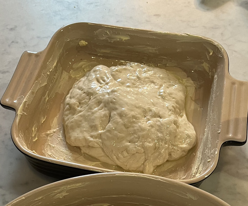
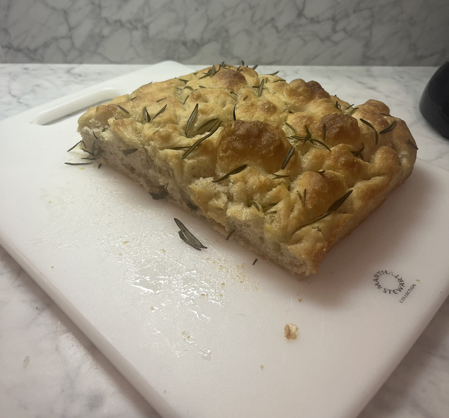

# Focaccia (September 2023)

I am happy to report that this is still [a bread making page](../brioche.html). This focaccia was delicious and very easy to make. Two thumbs way up.

I can confirm that Alexandra cooks, because [this was a good recipe](https://alexandracooks.com/2018/03/02/overnight-refrigerator-focaccia-best-focaccia/). 
The fresh rosemary really seals the deal for me and makes this extra delicious.

Rating:

- Dish: A
- Execution: A-

### Ingredients

- Bread flour
- Salt
- Yeast
- Water
- Butter
- Olive oil
- Rosemary leaves

### Logs

I am not a baker by any means, but I would say this is a good bread to start with to get your toes wet. You will have to proof for some time, but there
aren't any complicated ingredients and you will avoid strenuous kneading and mixing that some other breads (cough: *brioche*) require. It even has the
added benefit that making the dough all bubbly right before baking is certified fun.

|-|-|
|

Another benefit is that the proofing, at least in my case, was quite extreme in the fridge. It feels rewarding to put a little dough ball into the fridge
for the night and to wake to find the thing breathing like a lung.

|-|-|
|

I was a bit lost when I was reaching the final steps of the recipe. Once the dough has proofed at room temperature in the pan and filled up the space,
the directions say to grease your fingers with the oil and then stick them into the dough to create dimples and bubbles. This didn't compute for me. 
I looked at the before and after pictures but couldn't understand how pressing into the bread would create the bubbles. My sister reassured me over the phone
that this was normal and would work. Have faith.

|-|-|
|

Throw it in the oven and enjoy the smells, the taste, and the crunch of your delicious focaccia.

