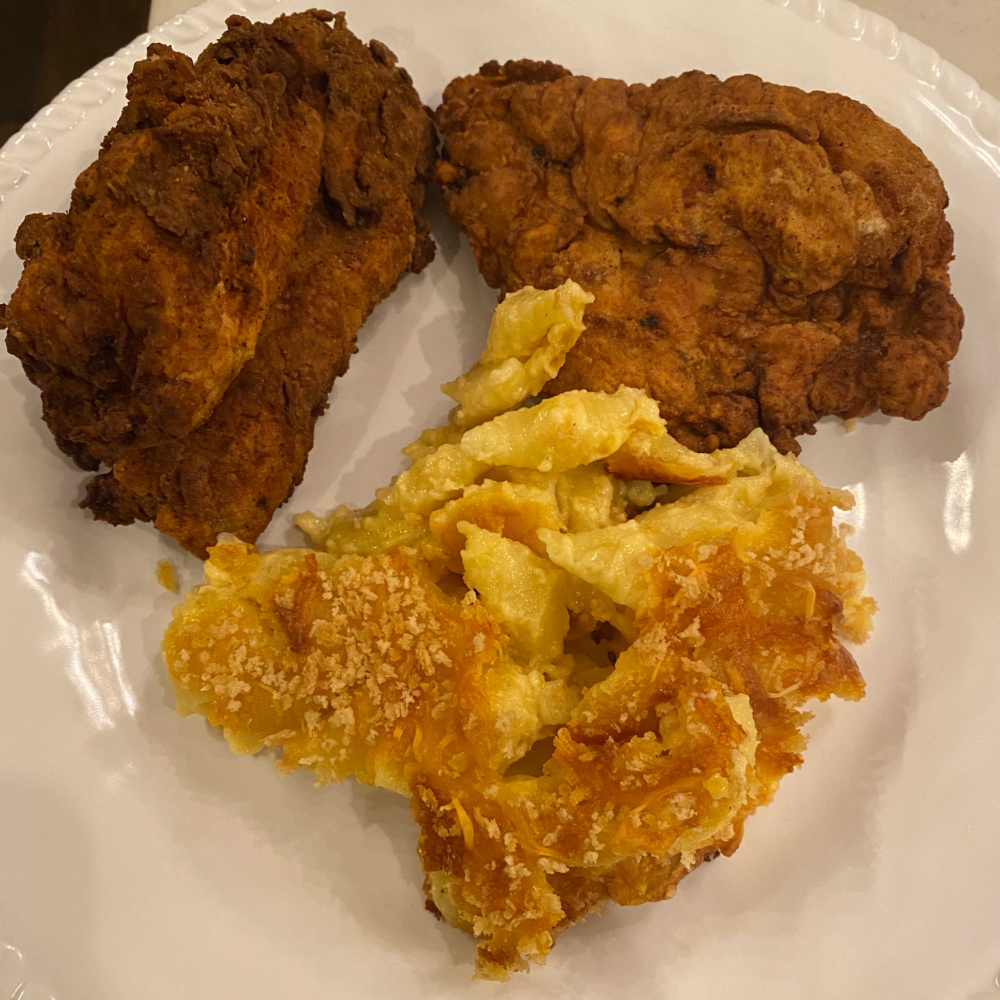
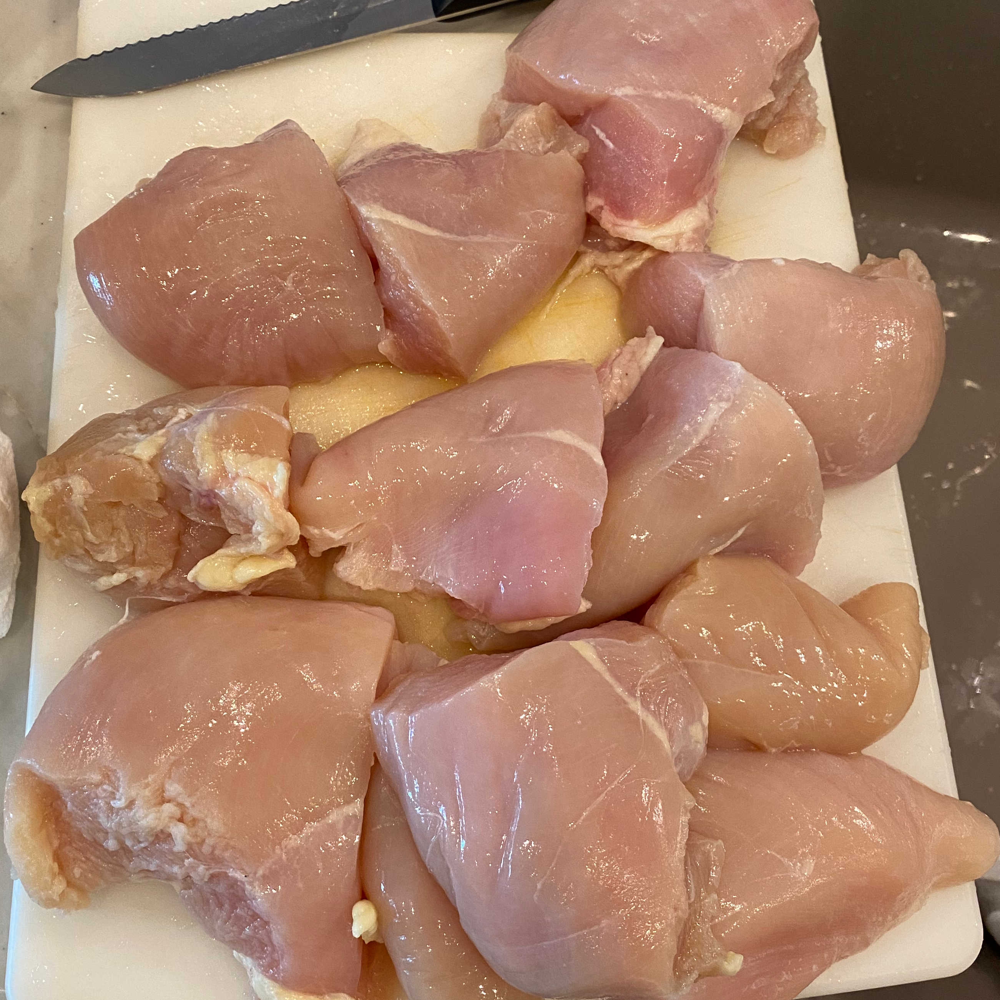
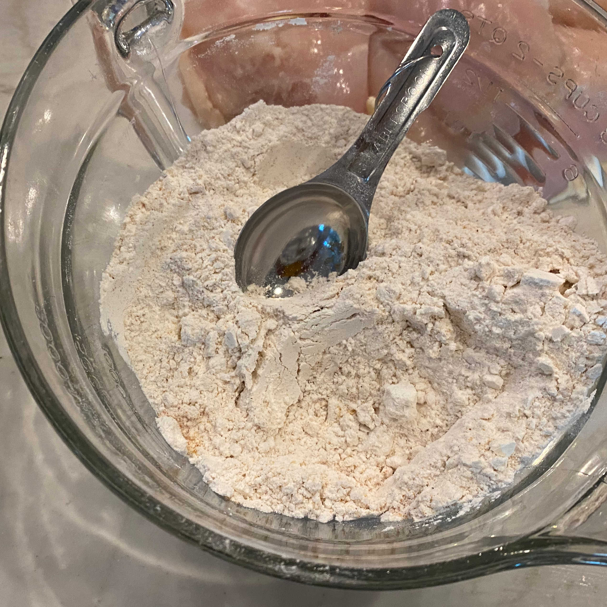
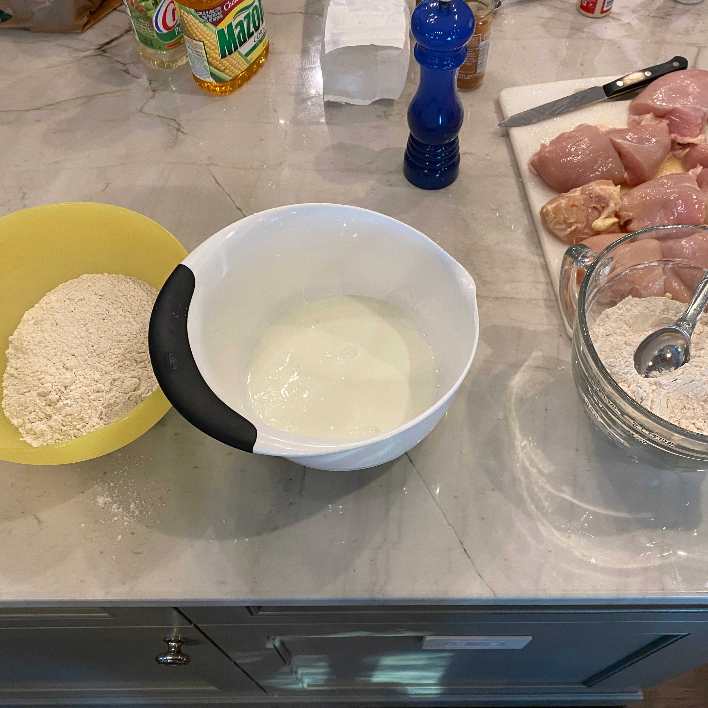
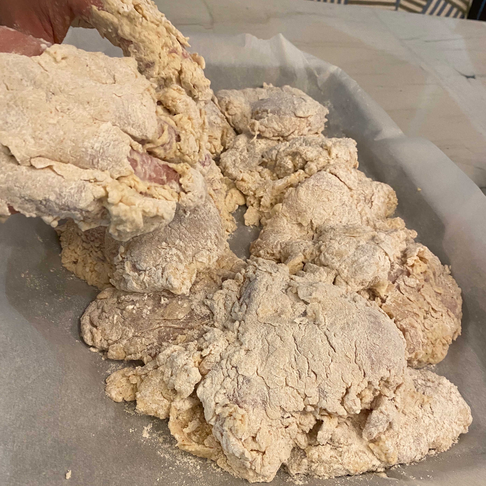
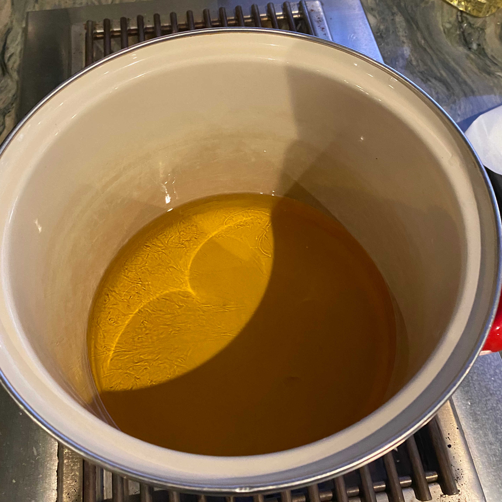
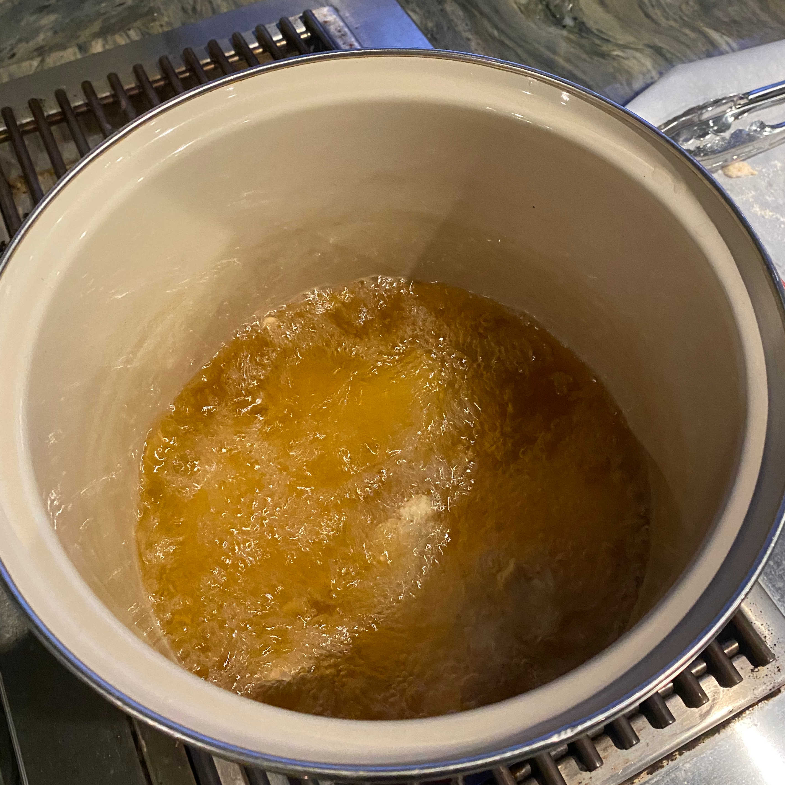
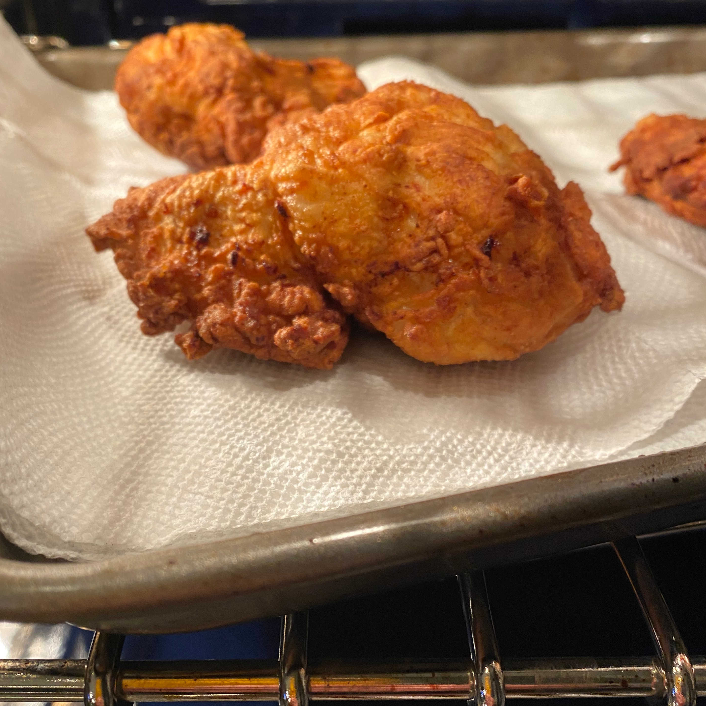
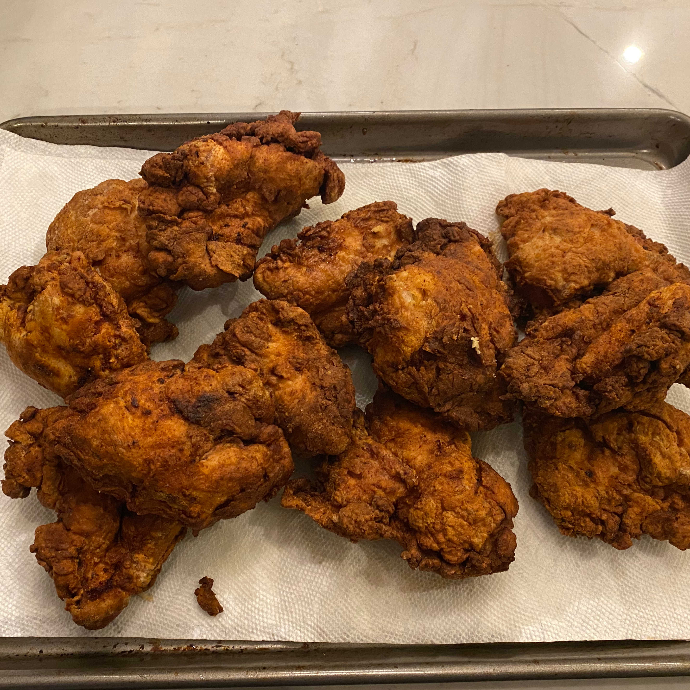

# Fried Chicken

Is there anything better than a crispy, juicy piece of fried chicken? Probably, but fried chicken is pretty good.

I followed a basic recipe from [food network](https://www.foodnetwork.com/recipes/fried-chicken-recipe10-3381583).

My mom also made some shell mac & cheese, but I won't be talking about that in this post.

- Ratings
  - Dish: A+
  - Execution: B+

### Ingredients

- Chicken breasts
  - I cut some sizable chicken breasts in half before frying
- Oil
  - We used a mixture of corn and canola
- Flour - 6 Cups
- Salt - Eyeballed
- Black Pepper - Eyeballed
- Garlic Powder - 2 tbsp
- Onion Powder - 1 tbsp
- Cayenne Pepper - 1 tsp
- Buttermilk - 2 cups

### Logs

Multiple recipes that we looked up involved [brining the chicken](https://en.wikipedia.org/wiki/Brining) and recommended letting the chicken brine for multiple hours. We didn't really have time for that, so we followed a simpler recipe that required no brine. Perhaps the brining will be fun to try in the future.

The process of making the fried chicken is rather simple:
1. Apply dry batter
2. Apply wet bath
3. Apply dry batter again
4. Fry

The batter is simple to create -- just flour and some basic spices all mixed together in a big bowl.

 | 
-|-
|

From my experience, it seems like applying the batter liberally and to the entire chicken is very important and not as easy as it seems. The first step to success is setting up your batter station. I set up 3 bowls in a row -- the first and last filled with my dry batter and the middle with the wet bath, which was just buttermilk.

Start by getting a light coating on the chicken in the first bowl. Then soak the chicken in the buttermilk. With the soaked chicken, you'll want to completely cover the chicken in the dry batter in the final bowl. The food network recipe suggests that you "aggressively push the flour mixture into the wet chicken". I really took out my anger on the poor pieces of chicken. For each piece, I laid the soaking chicken into the bowl and then punched the chicken breast into the dry batter with a closed fist. Then I flipped the breast over again and repeated until I was satisifed with the result. Once covered, I moved the chicken to a tray to get it out of the way for the next piece.

 | 
-|-
|

After the batter was applied, I let the chicken rest for about 20 minutes. I'm not sure this is strictly required, but it did give me confidence that I had applied the batter successfully. After 20 minutes, the batter was still sticking to the chicken all over.

The oil ended up giving me an embarrassing amount of trouble. I was trying to measure the temperature of the oil to the recomendded 325 degrees with a physical thermometer. But either due to clumsiness or some imperfection in the glass (or probably both), the thermometer cracked ever so slightly and dripped a bit of mercury into the hot oil. Sadly we had to throw out that oil and restart the process. We actually didn't have enough oil after having to void all of the mercurial oil, so I had to run to the store to fetch some more.

Once the oil is hot, it is straightforward to just fill up the pot with chicken. I deep fried the chicken, so I had to make sure the chicken was fully submerged in the hot oil. The chicken took between 15 and 20 minutes to cook all the way through.

 | 
-|-
|

Once the first batch was done, I put it onto a tray and then into the oven while we waited for all the chicken to cook. We kept the oven at 200 and this seemed to work well as the chicken was still delicious and hot when served.

This cooking experience reminded me why fried chicken is such an iconic food. It isn't too challenging to make and is absolutely delicious. A homemade, hot, juicy piece of fried chicken goes beyond food. If any dish could be described as a warm hug from a loved one, it would be fried chicken.

 | 
-|-
|
