# Hard Cider (October 2023)

Grab some apples. Make some wine (or cider). This was a super fun project that I hope to repeat many times. 
"Repeat" isn't quite the right word. I plan to experiment and create and tinker with many ciders to come.

I only had a hope of doing this at all thanks to my friend Aryn who is a fermentation expert. He helped me through
the process and guided me to helpful recipes and websites.

I used a few different guides to help me with the cider. I combined their knowledge to create my concoction.
- I purchased the [North Mountain Supply Wine Kit](https://www.amazon.com/gp/product/B07DJZF99M/ref=ppx_yo_dt_b_search_asin_title?ie=UTF8&th=1) from Amazon
- I followed the aptly named [howtomakehardcider.com](https://howtomakehardcider.com/making-your-cider) guide
- I read user EdWort's guide to make [apfelwein](https://www.homebrewtalk.com/threads/man-i-love-apfelwein.14860/)
  - Apfelwein and cider are (in my understanding) essentially the same drink except apfelwein is a German word and it is still.

Rating
- Dish: A+
- Execution: B-

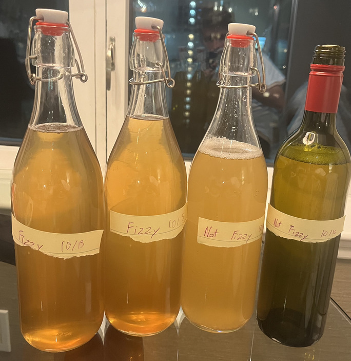

## Ingredients
- Montrachet yeast
- Pasteurized apple cider
- Sugar
- Water

The first thing I learned about making cider is that it really is just wine.
Many of the lesser known alcoholic beverages are really just wine. 
And this makes sense since the process is very simple. 
It's so simple, you could imagine it [accidentally occurring](https://www.arenaflowers.com/pages/history-of-wine/).

Wine, in the understanding of this inexperienced homebrewer, 
is just yeast, water, and a sugar provider. The sugar provider is frequently
a fruit (grapes = wine, apples = apfelwein/cider), but it can be even more straightforward,
like using honey to make mead. With patience, the yeast will convert the sugar to 
alcohol and the flavors of the ingredients will be deeply imbued into the mixture.
This combination leads to an intoxicating and yummy drink.

The most important part of making any alcohol is ensuring proper sanitization. Most of the active time spent making wine will be spent cleaning. You need to ensure no bacteria is introduced into your mixture. If you fail to do this properly, the bacteria will grow and multiply alongside the yeast, leading to a bad-looking and bad-tasting drink.

The sanitization goes farther when you use real fruit as your base for the drink. The fruit will contain bacteria all over it, infecting the brew. To prevent this, the kit I purchased came with Campden tablets which can help with this process. However, I did not use wild apples so the the tablets were unnecessary. Instead, I used high quality cider from the store that I ensured was pasteurized, meaning there would be no bacteria in the liquid.

Once I had cleaned all of my equipment, I was ready to get mixing. To start, I mixed in the cider and some extra sugar. Adding more sugar essentially just makes the brew more alcoholic. The sugar in the drink will be consumed by the yeast and converted into CO2 and alcohol &mdash; more sugar means more alcohol.

|-|-|
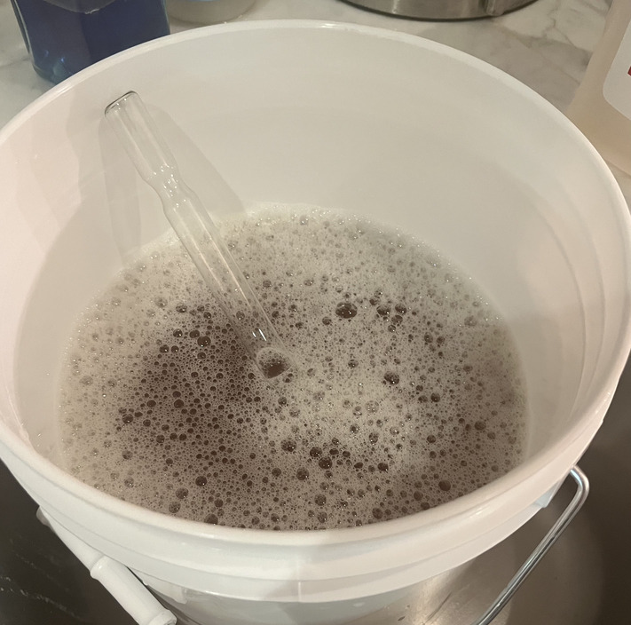|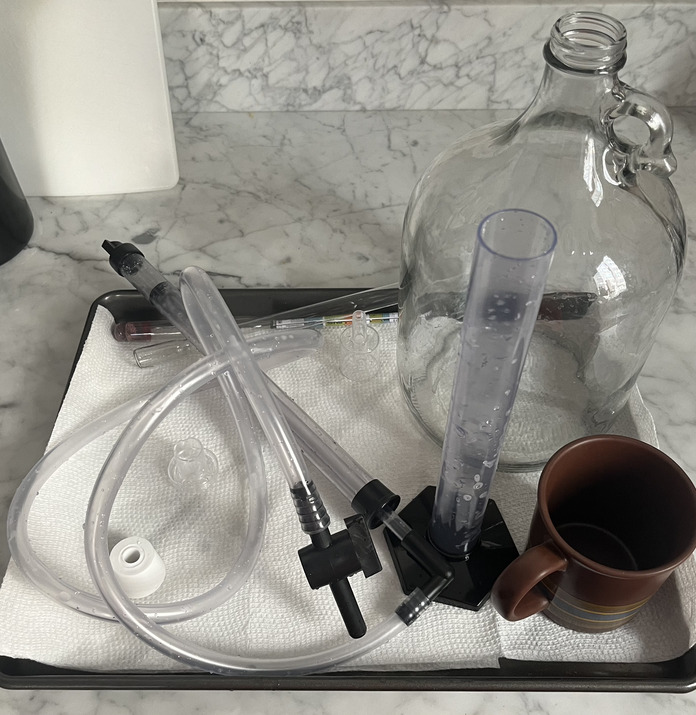

I added my gallon of cider from the store and added `0.4` pounds of sugar (181 grams). This is following EdWort's instructions from above, except scaling it back for only making a single gallon. Then I stirred everything together to absorb the sugar.

At this point, I was ready to measure the future ABV of the cider by using the hydrometer. I used the wine thief to transport a few vials of the mixture to the standing cylinder. I then spun the hydrometer into the cylinder to get the measurement (according to some source, spinning the hydrometer removes any latent bubbles sticking to the glass, improving the accuracy of the measurement). The measurement called out nearly 8% ABV. I felt quite good about this and was excited for a heavy drink.

I then pitched the yeast, which means to sprinkle the yeast over the drink but not to mix it. I did a dry pitch, which means I did not activate the yeast before adding. This seemed to work fine for me.

My first major mistake came while pitching. I forgot that I had reduced the recipe from 5 gallons to 1 gallon. However, I did not investigate or even think about how that should change how much yeast to include. I simply pitched the entire 5 gram packet &mdash; the suggested amount for a 5 gallon brew. Again, this worked for me, but I'll probably try reducing this in the future.

|-|-|
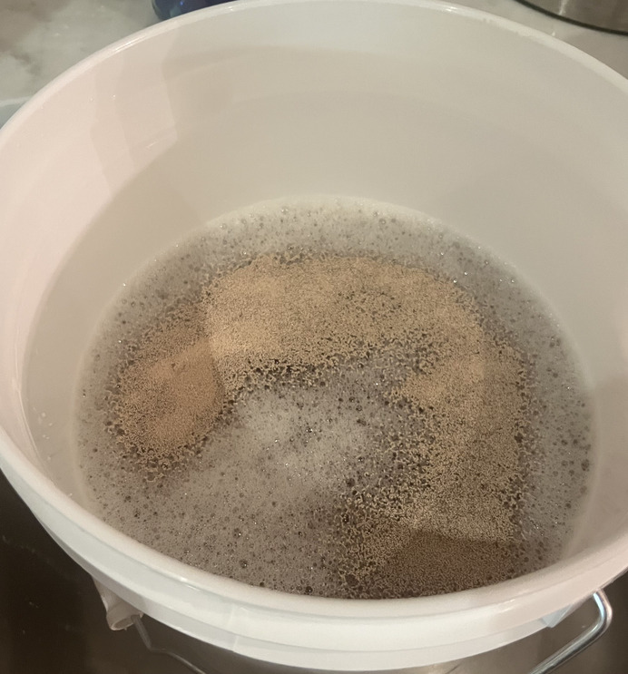|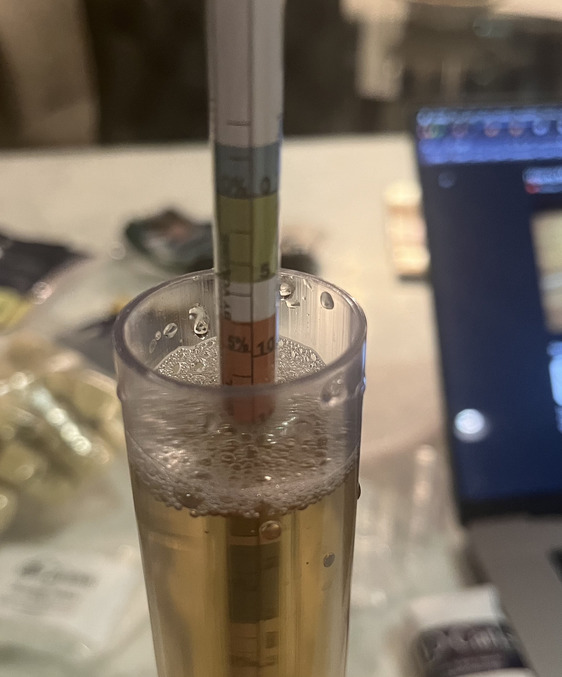

With the yeast pitched, the bucket was sealed up and the airlock installed. The airlock was filled with gin to ensure proper sterilization of the liquid.

Now the waiting began. I placed a sticky note on the bucket to easily remember when the process began and planned to come back after 10-14 days.

As the fermentation started, I noticed it was developing at the quicker end of the fermentation-speed spectrum. After just a day or so, I was getting multiple bubbles in less than 10 seconds. The bubbling rate decreased quite significantly after 4-5 days. Since this implied to me that the fermentation was occurring quickly, it meant that I should also rack the cider earlier in the process, closer to the 10 day mark.

I ended up racking after 11 days in primary. Racking is the process of moving the brew from the primary fermenter (the first bucket) to the secondary fermenter. The secondary fermentation usually lasts longer (this is what you might leave it in for months to age it) and must be in an airtight container (glass, not plastic).

|-|-|
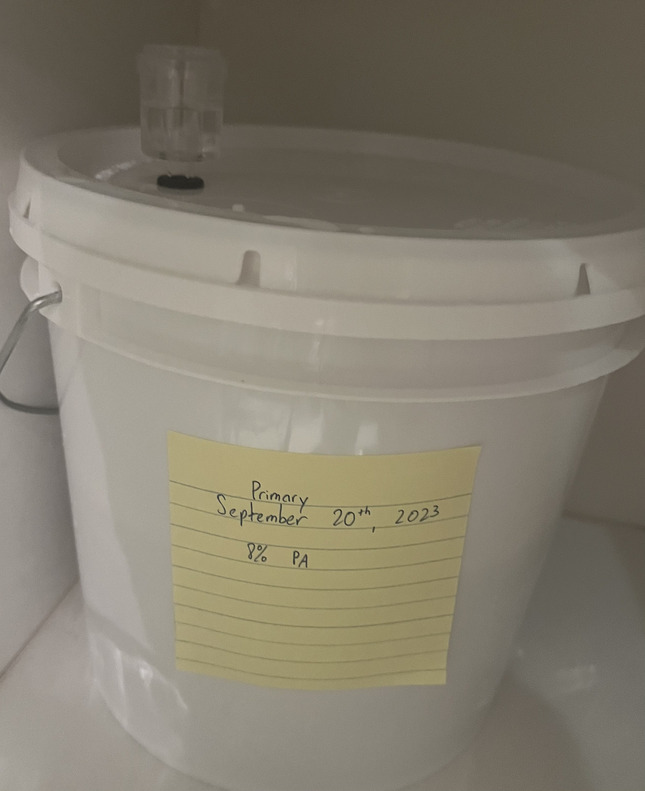|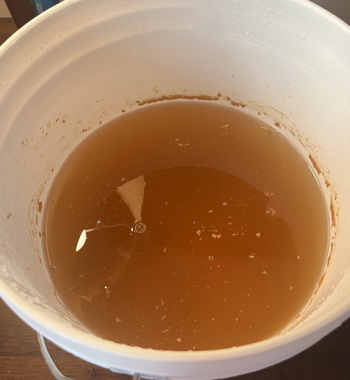

I performed the racking using a siphon, placing the bucket on top of my dresser and the glass carboy at my feet. Another learning here was that I should've practiced using the siphon multiple times with just plain water before performing it with the cider. There is a bit of a skill to develop and if you get it right, the process is quite easy. Otherwise, if you mess it up and you are on your own, you will find yourself fiddling with a spigot that is spewing your cider onto your feet (or so I have heard).

Before doing the racking, I ensured the fermentation had occurred with another measurement from the hydrometer and I did a little taste test of the immature cider. I was happy to find that it was still quite drinkable and clearly had a small level of alcohol in it (both from the taste and the from the flotation of the hydrometer).

|-|-|
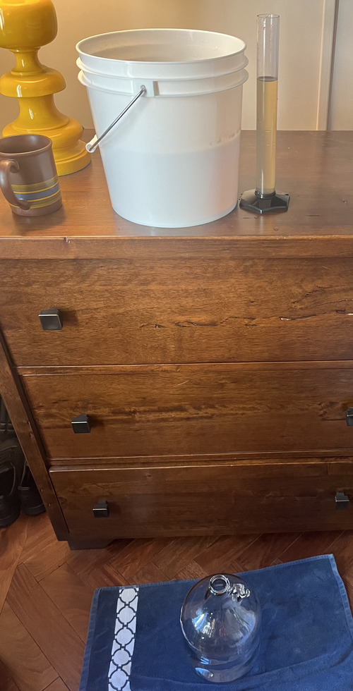|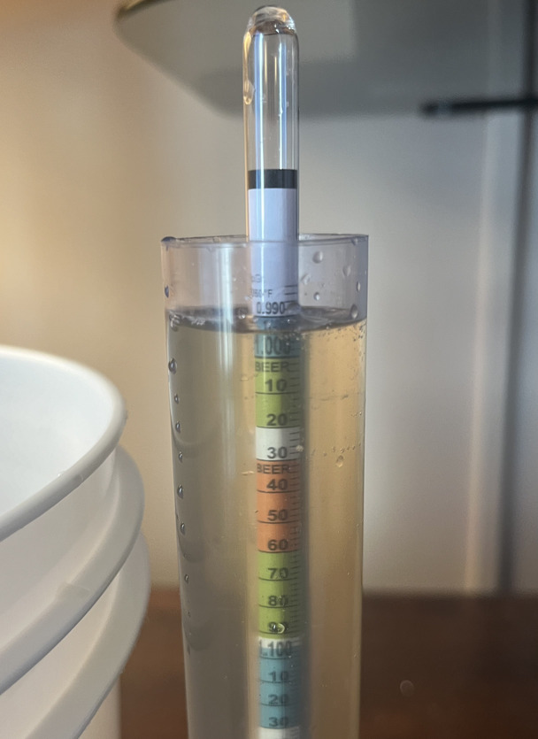

With racking and testing completed, I was excited for time to pass, flavors to develop, and cider to be ready.

I kept the drink in secondary for an additional 14 days (a bit on the shorter side) before moving onto bottling. I again used the siphon to perform the bottling and my previous experience helped greatly here.

I had a bit of experimentation in mind when performing the bottling. I planned to put the gallon into four separate bottles. Two of the bottles I would attempt to carbonate and two would be flat. The two flat ciders would have a further stratification. One would be put into an airtight container and one would be corked in a wine bottle. I hoped to discover a few things:
- How much time was required for carbonation? Did leaving the carbonated bottles for significantly longer actually improve the carbonation?
- Did the cider in the corked bottle improve, when compared to the uncarbonated cider, if it was left around for long enough?

|-|-|
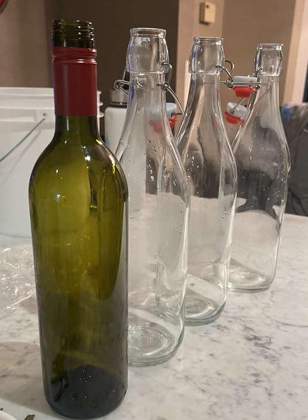|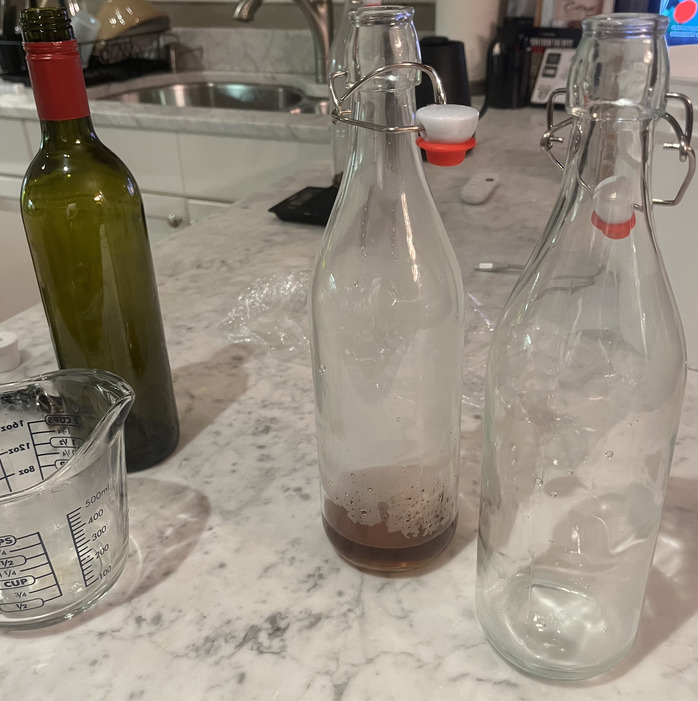

I used the "back carbonation" method. In this method, you put a bit more sugar into the cider during bottling. The extra sugar will be consumed by the latent yeast. However, since the bottle is in an airtight container, the CO2 cannot escape and will be forced into the liquid. I made some simple sugar using brown sugar and boiling water, adding this to two of the bottles before siphoning in the cider.

I was excited to do a little science. However, my scientific endeavor mostly failed in the face of convenience and a strong call to drink cider.

I ended up drinking the first uncarbonated cider in the airtight container after just a few days. I enjoyed it with some friends. We all were surprised to find that it tasted very little of alcohol. It tasted like a very tasty apple juice with just a hint of alcoholic burn. However, the effects of the 8% beverage were not lost on us and we empirically proved that the fermentation had been successful.

The two carbonated bottles were eventually pulled out for two separate parties at friends' houses. It was a great pleasure to break out the flip top bottle and ask my friends to enjoy a hard won glass of homebrew. The final bottle, the one that was "aged" using the corked top was consumed ~4 weeks after the first airtight bottle. The cider definitely tasted better than the first bottle, but I cannot declare the difference was the month of aging. The first bottle was not consumed at the proper temperature (it was a bit warm) so the aged bottle had a huge advantage that obscures the conclusions of the experiment. Alas, I will have to make more cider.

The carbonation was also not as significant as I had hoped and I believe this was mainly from a lack of time-in-bottle-with-sugar for the yeast. Both were consumed within two weeks of bottling. While the minor carbonation that occurred improved the drink, I'd love to make a sudsy, overflowing cider next time.

Overall, I greatly enjoyed this process. It was a bit intimidating to get underway as there are lots of opinions and information to find online. Thankfully, my friend who is quite experienced in fermentation helped me through the early stages. I've learned that homebrewing isn't all that difficult. As long as you have the time, patience, and ability to follow instructions, you can make something eminently potable. Many of the opinions that can be found online are a result of the myriad ways that people have discovered to make something delicious. This results in a lot of differing opinions about a single subtopic. What that really means (again, inexperienced homebrewer talking) is that there are many ways to skin a cat.

When I make cider again, I will definitely try to add some more interesting flavor notes into the brew. Maybe some nutmeg or cinnamon &mdash; something to give the drink a distinctive flavor that will stick with people. I received lots of compliments on the cider, but most of the compliments were a product of people's shock that someone had actually produced alcohol.

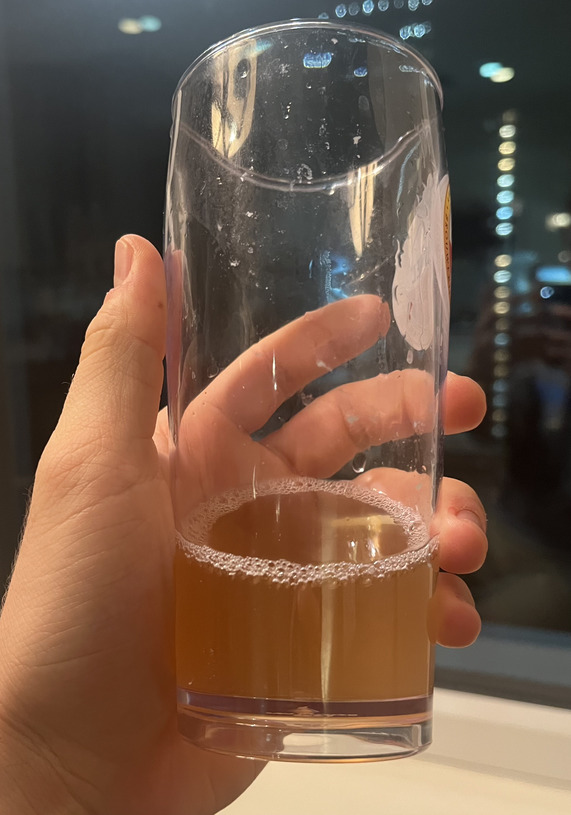

Life is short. Produce alcohol.
