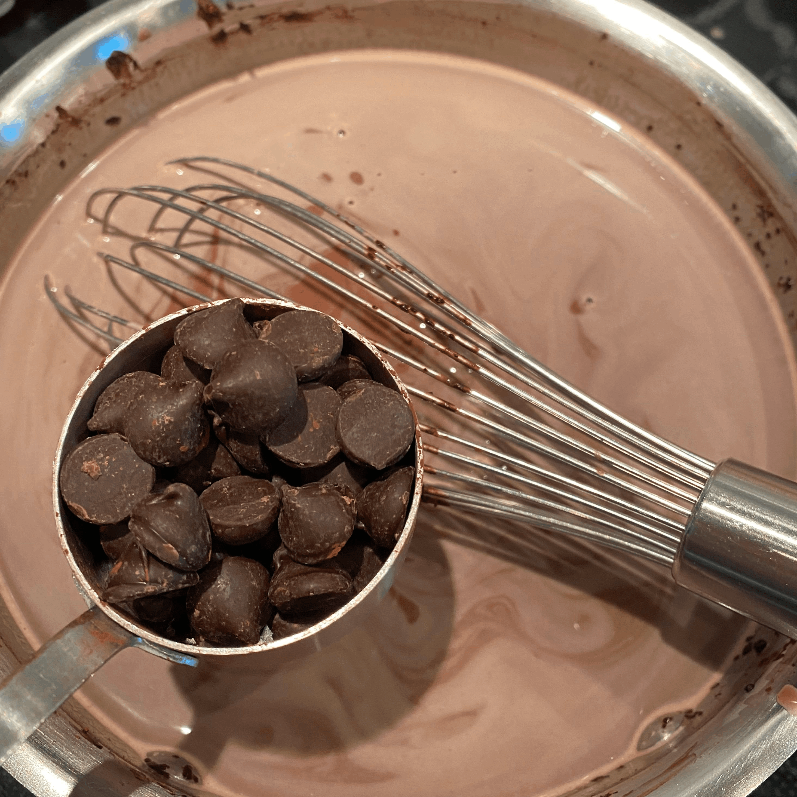

# Hot Chocolate (November 2021)

Hot chocolate on Thanksgiving may not be an age-old tradition, but it is delicious and sweet.

I followed a recipe from [this website](https://celebratingsweets.com/homemade-hot-chocolate/).

- Ratings
  - Dish: A
  - Execution: A

### Ingredients

- Milk (I used 2%)
- Cocoa Powder
- Sugar
- Chocolate Chips
- Vanilla Extract
- Extras:
  - Marshmallows
  - Whipped cream

### Logs

Making the hot chocolate from scratch was simple and quite delicious. There were not many surprises in the process - heat up some milk, add some chocolate, and you are basically there. The recipe that I followed called for a copious amount of whisking, making the ultimate result all the more rewarding.

|-|-|
|

The only tricky aspect of this process was making sure to get the temperature right. You want to make sure you get the liquid hot but not boiling. Additionally, after adding the milk, cocoa, and sugar, only then are the choclate chips and vanilla extract added. You want the mixture to be warm at this point to be able to melt the chips but not so hot that it is quite ready to serve. I used the amount of steam coming off the pot as a proxy for the heat; your mileage may vary. You can always fall back to the trusty finger-poking-for-just-moment method as well for more reliable results.

|-|-|
|

Once everything is nice and hot and mixed together, serve with a ladle into your mug of choice. Top with whatever extras you would like. For me that included marshmallows and whipped cream (and just a hint of Kahlua).
