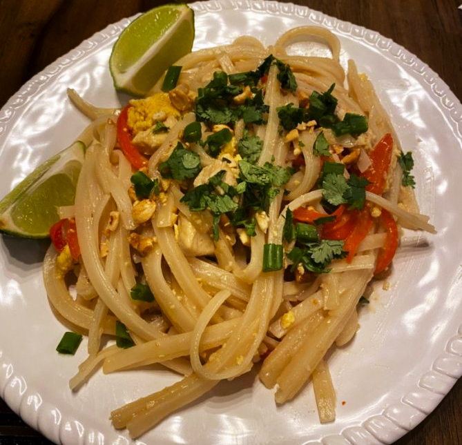
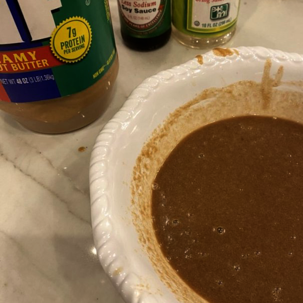
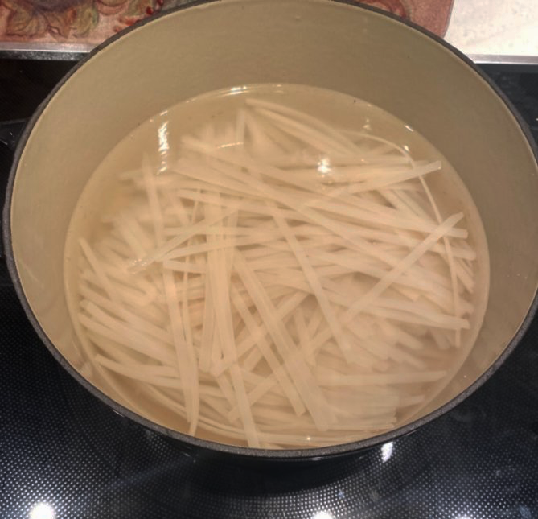
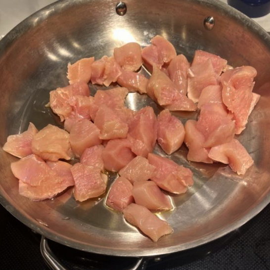
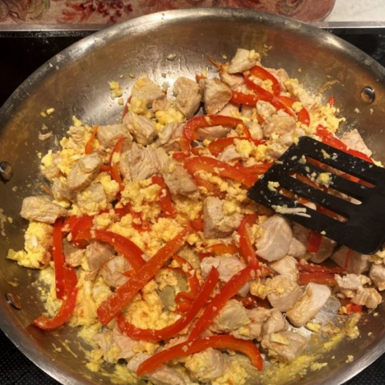

# Pad thai (October 2021)

For the first dish of the cooking journey, we are doing pad thai. Pad thai is easy to prepare and supremely delicious.

I followed the pad thai recipe [here](https://tastesbetterfromscratch.com/pad-thai/) (mostly).

- Ratings
  - Dish: A+
  - Execution: C-

### Ingredients

- Rice noodles (16 oz.)
- Meat - (1 chicken breast)
  - Pad thai is traditionally shrimp only, but I used chicken for this meal.
- Eggs - 3 scrambled
- Bell peppers - 1/2 sliced thinly
- Oil - Eyeballed
  - For the frying part of stir fry
- Garlic - 5 cloves minced
- Peanuts - Preference
- Green onions - Preference
- Limes - Preference
- Cilantro - Preference
- Sauce ingredients:
  - Soy sauce - 2 tbsp
  - Rice vinegar - 4 tbsp
  - Brown sugar - 10 tbsp
  - Peanut butter - 2 tbsp

### Logs

I was surprised to see some of these ingredients on the list, specifically the brown sugar and the peanut butter for the sauce. However, after I tasted the sauce, I realized how important they are. They provide the right sweetness and thickness to the sauce. Adding the peanut butter to the sauce mixture gave it a weird texture at first. When you start mixing, the peanut butter wants to stick together in clumps. You will have a disgusting looking mix of soy sauce, vinegar, and chunks of peanut butter. I got a whisk out to properly mix everything together. Once it is a uniform mixture, you can give it a taste - it should take like pad thai.

I am continuing to have issues with cooking rice noodles. While I haven't done it many times in the past, they are never coming out quite right; in truth, they are closer to quite wrong. While it doesn't seem like it when the noodles are evacuated from the packaging, they love to stick together once they are put into the pot. If they stick together it will ruin them for multiple reasons: 1) they will be thicker than you want and won't be as handlable as you'd like and 2) they will not cook evenly, leaving some unappetizing, hard parts of the rice noodle.

|-|-|
|

The timing of the cooking was suboptimal. We let the chicken sit in the pan for too long before adding the peppers. The peppers were not bad, but they could've done with slightly more cooking.

Another big miss of this recipe was our use of oil. We didn't add nearly enough at the beginning and then did not add any more before adding the later ingredients. Nothing in the meal was really "fried". This far from ruined the meal but was a big miss that can be improved in the future. I think the pan and oil should be extremely hot when adding more ingredients.

|-|-|
|

Cooking pad thai in any significant quantity will make you understand why woks are traditioanlly used in its preparation. Using a plain pan does not provide the surface area or volume that you'll want when you add a huge batch of rice noodles to a heap of chicken and eggs.

Can you add too much cilantro to your pad thai? Yes.

The main takeaway from this dish is that it is hard to mess up pad thai so badly that it isn't delicious. I made some hard, thick noodles, didn't fry things properly, had a severe shortage of soy sauce, and piled on a heaping of cilantro. It was still a joy to eat.
