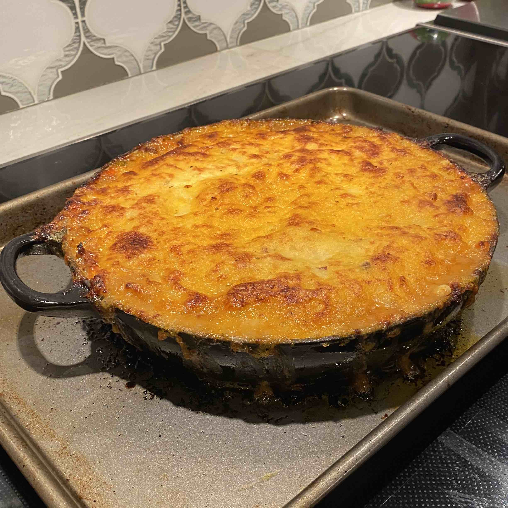
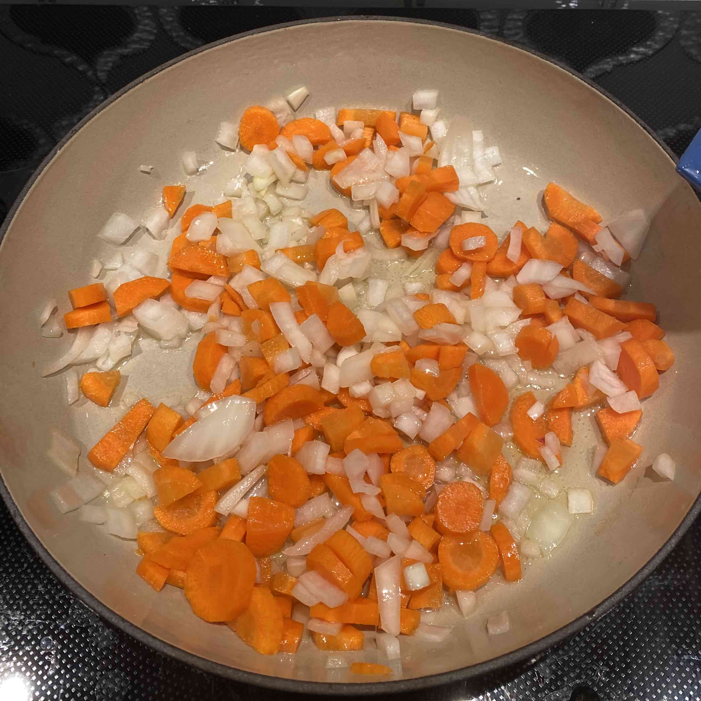
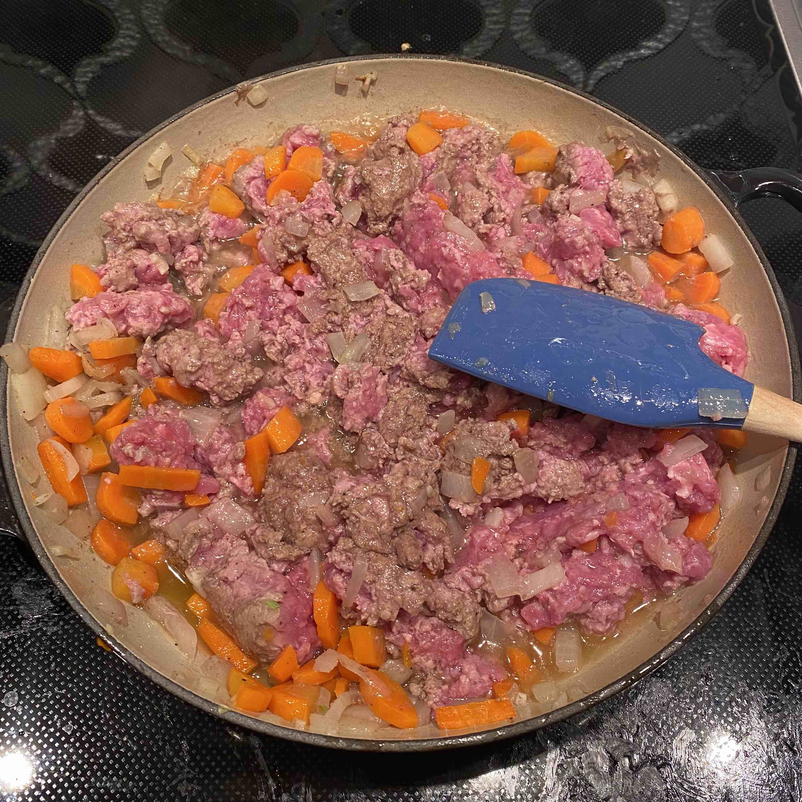
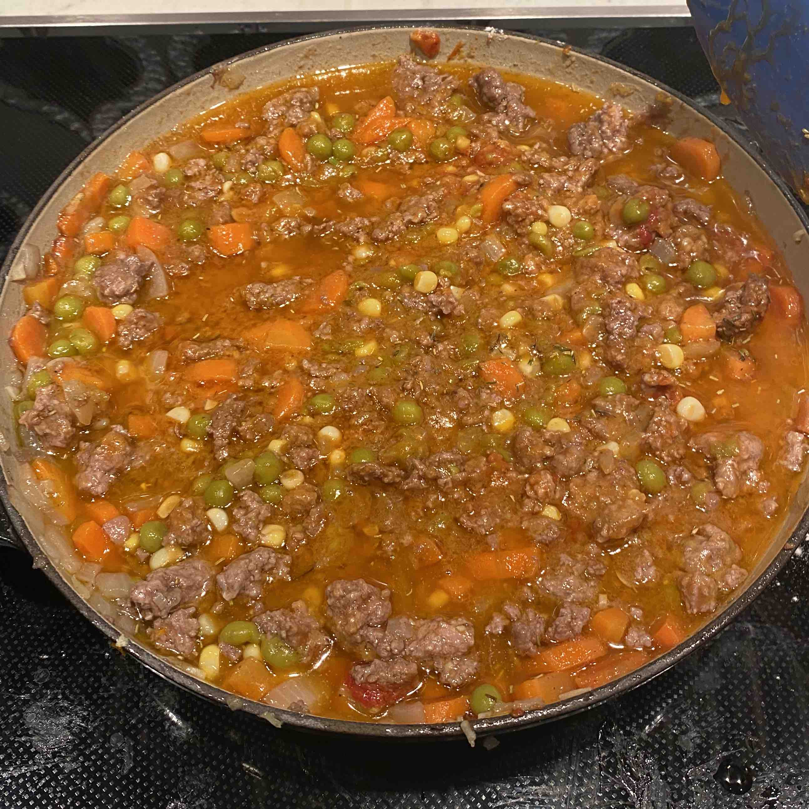
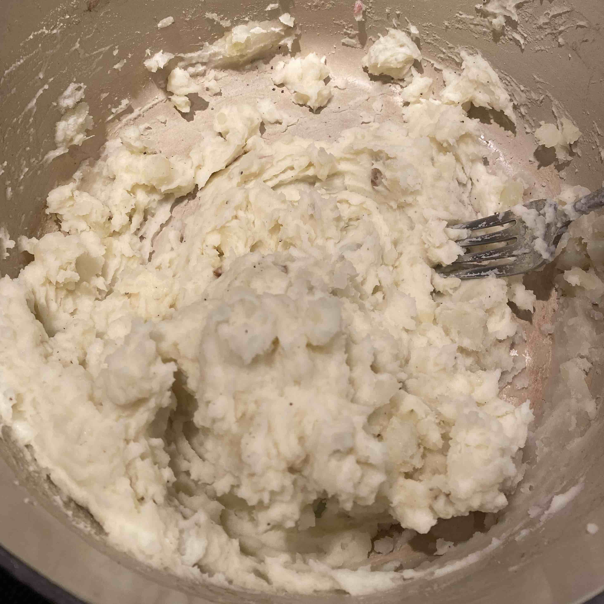
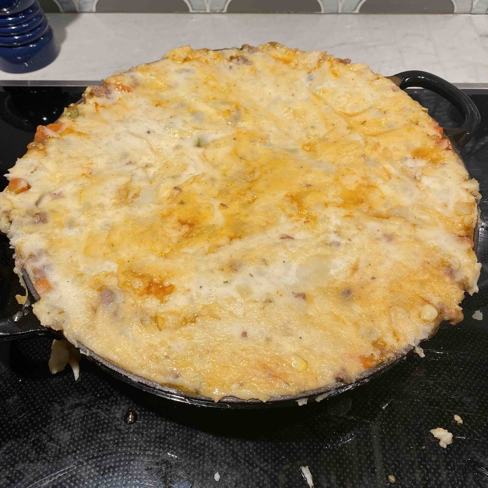
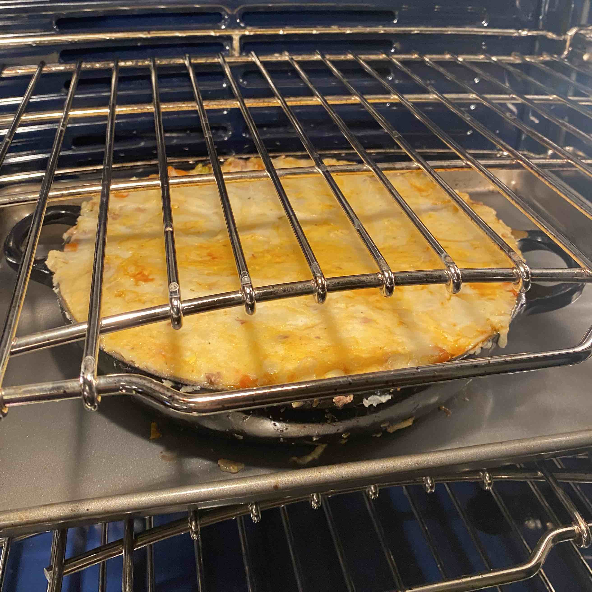
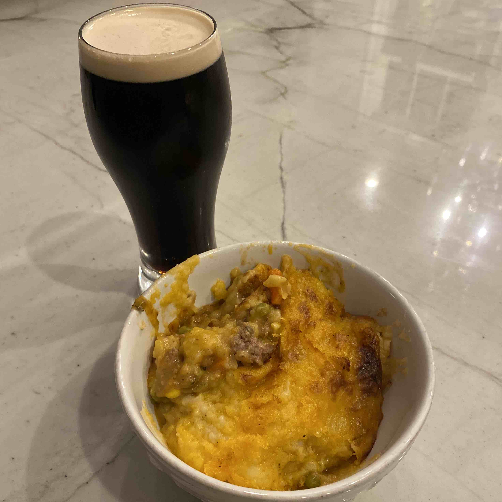

# Shepherd's Pie (December 2021)

I'm not sure I'd ever had shepherd's pie before I made it for this entry of the chef's log, but the thought of a Guinness and shepherd's pie aroused a pastoral memory from deep within me.

I followed [this recipe](https://www.foodnetwork.com/recipes/alton-brown/shepherds-pie-recipe2-1942900) from the food network

Rating:
- Dish: A+
- Execution: A-

### Ingredients

#### Meat Filling

- Ground lamb
- Vegetable oil
- Chopped onion
- Chopped carrots
- Peas
- Corn
- Tomato paste
- Minced garlic
- Chicken broth
- Flour
- Worcestershire sauce
- Rosemary
- Thyme
- Salt and pepper

#### Mashed Potatoes

- Potatoes
  - I used what we had, which was 2 russet potatoes and 2 red potatoes. I could've used more.
- Salt and Pepper
- Butter
- Half and half

### Logs

Shepherd's pie turned out to be an ambitious endeavor. I have never made such a mess in the kitchen - oil, flour, and mashed potatoes covered the stove by the time all was said and done. Despite this, I am quite happy with how everything turned out. The resulting meal was undeniably delicious, but the dish may have been unduly aided by the accompaniment of a Guinness.

|-|-|
|

The task starts off simple - heat up some oil, throw in those tough vegetables to let them soften (onions and carrots), mix in the minced garlic, and add the meat a few minutes later. This is another dish that is made easier by the use of a large pan, nimble fingers, or both.

|-|-|
|

At this point, I unintentionally went off script. The recipe calls for the corn and peas to be added to the broth at the very end, but my naive chef's mind told me to add them in along with the chicken broth and tomato paste. I am certain this did not have a big effect, but it may give you some idea of how overwhelmed I felt as I added more ingredients and my pan started to bubble over with lamb and Worcestershire.

I am much more experienced at making mashed potates. The potatoes made for this dish were quite tasty as I added a generous amount of butter and cream.

|-|-|
|

Despite my knowledge of mashed potatoes, I barely made enough to cover the pie. It turns out that rubber spatulas have a secret super power: the spreading mashed potatoes thinly and evently. At first, as I layered the mashed potatoes onto the stew, I attempted to spread them out with a simple fork. The fork failed me as it grabbed onto the mashed potatoes as I spread. Panicking, I tried to spread with the fork more aggressively, burying some of the potatoes deep into the meat. As a last resort, I reached into my arsenal of tools and pulled out the rubber spatula. It was so effective, I wouldn't be surprised to learn that they were originally marketed as mashed-potato-spreader-sticks.

Once I was satisfied with the covering, I placed the pan onto a baking sheet (do not forget to do this) and put it all into the oven. Following the online recipe, I even broiled the whole thing for the last 5 minutes, adding to the color. Let the pie cool for a few minutes and then serve with Guinness.

